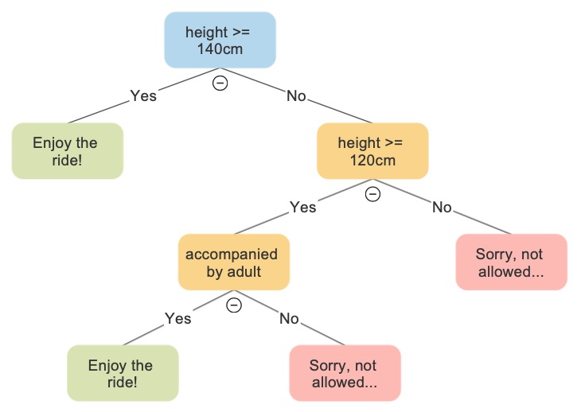
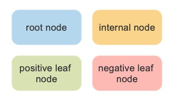
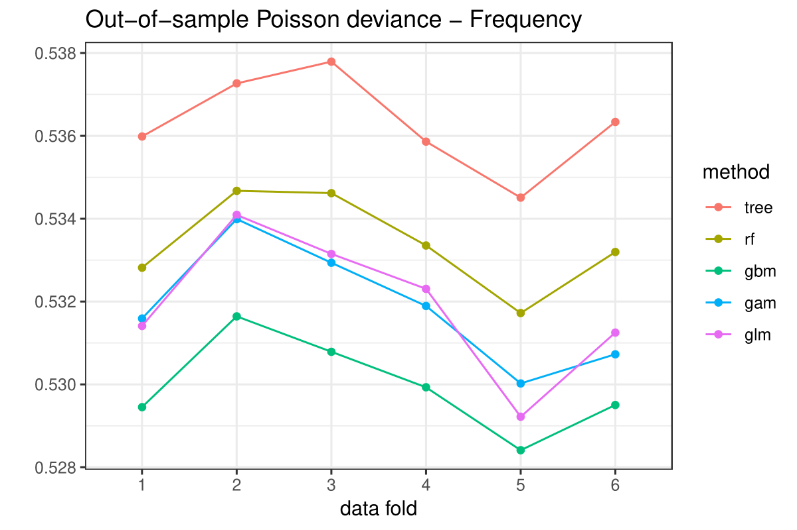
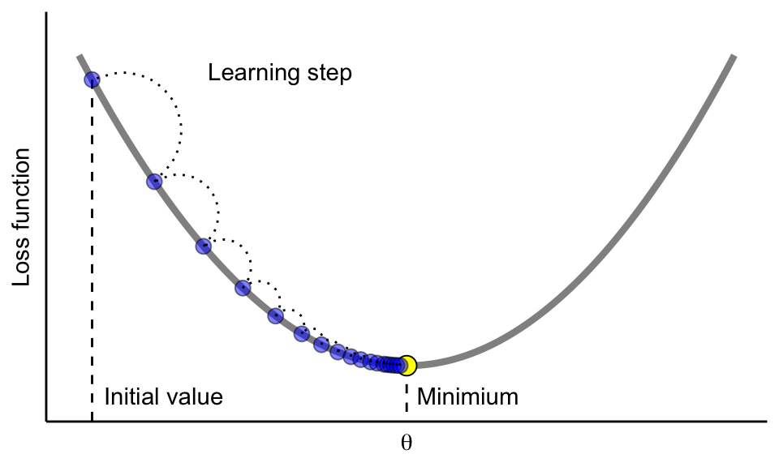

```{r setup, include=FALSE}
evaluate_r = TRUE
options(htmltools.dir.version = FALSE)
library(knitr)
knitr::opts_chunk$set(warning = FALSE, message = FALSE, cache = TRUE, cache.lazy = TRUE, fig.align = 'center')
# options(knitr.table.format = "html")
data_path <- 'data/'
library(tidyverse)
library(magrittr)
ggplot2::theme_set(theme_bw())
library(rpart)
library(rpart.plot)
library(vip)
library(pdp)
library(ipred)
library(ranger)
library(distRforest) # from github: https://github.com/henckr/distRforest
library(gbm)
library(xgboost)
library(h2o)
library(gganimate)
library(transformr)
library(fontawesome) # from github: https://github.com/rstudio/fontawesome
library(zeallot) # for unpacking operator %<-%
#library(gt) # from github: https://github.com/rstudio/gt
#library(countdown) # from github: https://github.com/gadenbuie/countdown 
plot_pred_reg <- function(dt, preds){
  dt %>% mutate(pred = preds) %>% ggplot(aes(x = x)) +
  geom_point(aes(y = y), alpha = 0.3) +
  geom_line(aes(y = m), colour = 'darkgreen', size = 1.5) +
  geom_line(aes(y = pred), colour = 'darkred', size = 1.5)
}
plot_pred_class <- function(dt, preds){
  dt %>% mutate(pred = preds) %>% ggplot(aes(x = x1, y = x2)) +
  geom_point(aes(color = pred))
}
#' Calculate the Poisson deviance
#' @param y The true values (numeric vector)
#' @param yhat The estimates for y (numeric vector or matrix with one col per model)
#' @param w Optional case weights (numeric vector)
#' @param scaled Deviance scaled by number of observations or not (boolean)
#' @return A single number or numeric vector if ncol(yhat)>1
dev_poiss <- function(y, yhat, w = 1, scaled = TRUE){
  sf <- ifelse(scaled, 1/length(y[!is.na(y)]), 1)
  if(!is.matrix(yhat)) return(-2*sf*sum(w*(dpois(y,yhat,log=TRUE) - dpois(y,y,log=TRUE)), na.rm = TRUE))
  return(-2*sf*colSums(w*(dpois(y,yhat,log=TRUE) - dpois(y,y,log=TRUE)), na.rm = TRUE))
}
KULbg <- '#116E8A'

hook_output <- knit_hooks$get("output")
knit_hooks$set(output = function(x, options) {
  lines <- options$output.lines
  if (is.null(lines)) {
    return(hook_output(x, options))  # pass to default hook
  }
  x <- unlist(strsplit(x, "\n"))
  more <- "..."
  if (length(lines)==1) {        # first n lines
    if (length(x) > lines) {
      # truncate the output, but add ....
      x <- c(head(x, lines), more)
    }
  } else {
    x <- c(more, x[lines], more)
  }
  # paste these lines together
  x <- paste(c(x, ""), collapse = "\n")
  hook_output(x, options)
})
```

# Today's outline


.pull-left[
* [Very short introduction](#intro)

* [Decision tree](#tree)

  + Tree basics
  + Toy example for regression
  + Pruning via cross-validation
  + Toy example for classification
  + Claim frequency prediction
  + Interpretation tools

* [Bagging and random forest](#bag_rf)

  + Bagging basics
  + Dominant features
  + Random forest
  + Tuning with a Cartesian grid search
  + Something for the actuaries
]

.pull-right[
* [Gradient boosting machine](#gbm)

  + Boosting basics
  + Important parameters
  + Claim frequency prediction
  + XGBoost

* [H2O](#h2o)

  + H2O basics
  + Tuning with a random grid search
  + Stacking
]


<br>

.center[.font200[`r fa(name = 'laptop', fill = KULbg)`] .KULbginline[Happy coding!]]

---
name: map-ML-world
class: right, middle, clear
background-image: url("img/map_ML_world.jpg")
background-size: 45% 
background-position: left


.KULbginline[Some roadmaps to explore the ML landscape...] 


.font60[Source: [Machine Learning for Everyone In simple words. With real-world examples. Yes, again.](https://vas3k.com/blog/machine_learning/)]

---

class: inverse, center, middle
name: intro

# Very short introduction

<html><div style='float:left'></div><hr color='#FAFAFA' size=1px width=796px></html>

---

# What is tree-based machine learning?

* .KULbginline[Machine learning (ML)] according to [Wikipedia](https://en.wikipedia.org/wiki/Machine_learning):

> *"Machine learning algorithms build a .hi-pink[mathematical model] based on sample data, known as training data, in order to make predictions or decisions without being explicitly programmed to perform the task."*

> This definition goes all the way back to [Arthur Samuel](https://en.wikipedia.org/wiki/Arthur_Samuel), who coined the term "machine learning" in 1959.

* .KULbginline[Tree-based ML] makes use of a .hi-pink[tree] as building block for the mathematical model.

```{r tree_based, out.width='70%', echo=FALSE}

```

* What is a .KULbginline[tree]?

---

class: inverse, center, middle
name: Decision tree

# Decision tree

<html><div style='float:left'></div><hr color='#FAFAFA' size=1px width=796px></html>

---

class: clear
background-image: url(img/decision_tree.jpg)
background-size: contain

---

# Tree structure and terminology

* Top of the tree contains all available training observations: .hi-pink[root node]

* Partition the data into homogeneous non-overlapping subgroups: .hi-pink[nodes]

* Subgroups formed via .KULbginline[simple yes-no questions]

* Tree predicts the output in a .hi-pink[leaf node] as follows:
  + average of the response for regression
  + majority voting for classification

---

# Tree structure and terminology

* Top of the tree contains all available training observations: .hi-pink[root node]

* Partition the data into homogeneous non-overlapping subgroups: .hi-pink[nodes]

```{r out.width= "50%", out.extra='style="float:right; padding:10px"', echo=FALSE}

```

* Subgroups formed via .KULbginline[simple yes-no questions]

* Tree predicts the output in a .hi-pink[leaf node] as follows:
  + average of the response for regression
  + majority voting for classification
  
* Different types of nodes:

```{r out.width= "27%", echo=FALSE}

```


---

# Tree growing process

* Golden standard is the .hi-pink[c]lassification .hi-pink[a]nd .hi-pink[r]egression .hi-pink[t]ree algorithm: .KULbginline[CART]

* CART uses .KULbginline[binary recursive partitioning] to split the data in subgroups

* At each node, search for the best feature to partition the data in two regions: R<sub>1</sub> and R<sub>2</sub> (hence, .hi-pink[binary])

* .KULbginline[ Best?] Minimize the overall loss between observed responses and leaf node prediction
  + overall loss = loss in R<sub>1</sub> + loss in R<sub>2</sub>
  + regression: mean squared/absolute error, deviance,...
  + classification: cross-entropy, gini index,...

* After splitting the data, this process is repeated for region R<sub>1</sub> and R<sub>2</sub> separately (hence, .hi-pink[recursive])

* Repeat until .hi-pink[stopping criterion] is satisfied, e.g., maximum depth of a tree or minimum loss improvement

* CART is implemented in the {rpart} package .font200[`r fa(name = 'box-open', fill = KULbg)`]

---

# Using {rpart}

```{r, eval=FALSE}
rpart(formula, data, method,
      control = rpart.control(cp, maxdepth, minsplit, minbucket))
```

* `formula`: a formula as *response ~ feature1 + feature2 + ...* &nbsp;&nbsp;&nbsp;&nbsp;&nbsp; .font200[`r fa(name = 'bullhorn', fill = KULbg)`] no need to include the interactions!

* `data`: the observation data containing the response and features

* `method`: a string specifying which .hi-pink[loss function] to use
  + "anova" for regression (SSE as loss)
  + "class" for classification (Gini as loss)
  + "poisson" for Poisson regression (Poisson deviance as loss, see more later)
  
* `cp`: complexity parameter specifying the proportion by which the overall error should improve for a split to be attempted
  
* `maxdepth`: the maximum depth of the tree

* `minsplit`: minimum number of observations in a node for a split to be attempted

* `minbucket`: minimum number of observations in a leaf node

---

# Toy example for regression

.pull-left[
```{r}
set.seed(54321) # reproducibility
dfr <- tibble(
  x = seq(0, 2*pi, length.out = 500),
  m = 2*sin(x),
  y = m + rnorm(length(x), sd = 1)
  )
```
```{r, echo=FALSE}
print(dfr)
```

]

.pull-right[
```{r, echo = FALSE}
ggplot(dfr, aes(x = x)) + geom_point(aes(y = y), alpha = 0.3) + geom_line(aes(y = m), colour = 'darkgreen', size = 1.5)
```
]

---

# Decision stump (tree with only one split)

.pull-left[
```{r}
fit <- rpart(formula = y ~ x,
             data = dfr,
             method = 'anova', #<<
             control = rpart.control(
               maxdepth = 1 #<<
               )
             )
print(fit)
```
```{r, eval=FALSE}
# Nice plots with the rpart.plot package
rpart.plot(fit, digits = 4, cex = 2) #<<
```
]

.pull-right[
```{r,echo=FALSE}
rpart.plot(fit, digits = 4, cex = 2)
```
]

---
# Decision stump (tree with only one split)

.pull-left[
```{r}
fit <- rpart(formula = y ~ x,
             data = dfr,
             method = 'anova', #<<
             control = rpart.control(
               maxdepth = 1 #<<
               )
             )
print(fit)
```
```{r,eval=FALSE}
# Get predictions via the predict function
pred <- predict(fit, dfr) #<<
```
]

.pull-right[
```{r, echo=FALSE}
plot_pred_reg(dt = dfr, preds = predict(fit, dfr))
```
]

---

# Let's add some splits

.pull-left[
```{r}
fit <- rpart(formula = y ~ x,
             data = dfr,
             method = 'anova',
             control = rpart.control(
               maxdepth = 2 #<<
               )
             )
print(fit)
```
]

.pull-right[
```{r, echo=FALSE}
rpart.plot(fit, digits = 4, cex = 1.5)
```
]

---

# Let's add some splits

.pull-left[
```{r}
fit <- rpart(formula = y ~ x,
             data = dfr,
             method = 'anova',
             control = rpart.control(
               maxdepth = 2 #<<
               )
             )
print(fit)
```
]

.pull-right[
```{r, echo=FALSE}
plot_pred_reg(dt = dfr, preds = predict(fit, dfr))
```
]

---

name: yourturn
class: clear

.left-column[

<!-- Add icon library -->
<link rel="stylesheet" href="https://cdnjs.cloudflare.com/ajax/libs/font-awesome/4.7.0/css/font-awesome.min.css">

## <i class="fa fa-edit"></i> <br> Your turn

]

--

.right-column[
Let's get familiar with the structure of a decision tree. <br>
Choose your favorite tree and leaf node, but keep it .hi-pink[simple] for now.

1. Replicate the .KULbginline[predictions] for that leaf node, based on the split(s) and the training data.

1. Replicate the .KULbginline[deviance] measure for that leaf node, based on the split(s), the training data and your predictions from Q1. 

* Hint: the deviance used in an anova {rpart} tree is the .hi-pink[Sum of Squared Errors (SSE)]:

$$\begin{eqnarray*}
\textrm{SSE} = \sum_{i=1}^n (\color{#FFA500}{y}_i - \hat{\color{#3b3b9a}{f}}(\color{#e64173}{x}_i))^2,
\end{eqnarray*}$$

]

---

class: clear

.pull-left[
Take for example the tree with two levels:
```{r}
print(fit)
```
Let's predict the values for leaf node 6
]

.pull-right[
.hi-pink[Q1]: calculate the prediction
```{r}
# Subset observations in node 6
obs <- dfr %>% dplyr::filter(x < 0.535141)

# Prediction
pred <- obs$y %>%  mean
pred
```

.hi-pink[Q2]: calculate the deviance
```{r}
# Deviance
dev <- (obs$y - pred)^2 %>% sum
dev
```
]


---

# Let's build a very deep tree

.pull-left[
```{r}
fit <- rpart(formula = y ~ x,
             data = dfr,
             method = 'anova',
             control = rpart.control(
               maxdepth = 20, #<<
               minsplit = 10, #<<
               minbucket = 5, #<<
               cp = 0 #<<
               )
             )
```

.font200[`r fa(name = 'bullhorn', fill = KULbg)`] Note on the `cp` parameter:
* Unitless in {rpart} (different from original CART)
  + `cp = 1` returns a .hi-pink[root node], without splits
  + `cp = 0` returns the .hi-pink[deepest tree possible], allowed by other stopping criteria
]

.pull-right[
```{r, echo=FALSE}
plot_pred_reg(dt = dfr, predict(fit, dfr))
```
]

---

# Let's build a very deep tree

.pull-left[
```{r}
fit <- rpart(formula = y ~ x,
             data = dfr,
             method = 'anova',
             control = rpart.control(
               maxdepth = 20, #<<
               minsplit = 10, #<<
               minbucket = 5, #<<
               cp = 0 #<<
               )
             )
```

<br> 
.font200[`r fa(name = 'sad-tear', fill = KULbg)`] Clearly dealing with .KULbginline[overfitting]

]

.pull-right[
```{r, echo=FALSE}
plot_pred_reg(dt = dfr, predict(fit, dfr))
```
]

---

#  How deep should a tree be?

.pull-left[
* Remember the .KULbginline[bias-variance tradeoff]:
  + .hi-pink[shallow] tree: bias .font150[`r fa(name = 'arrow-circle-up', fill = KULbg)`] and variance .font150[`r fa(name = 'arrow-circle-down', fill = KULbg)`] <br>
  ---> .KULbginline[underfit]
  + .hi-pink[deep] tree: bias .font150[`r fa(name = 'arrow-circle-down', fill = KULbg)`] and variance .font150[`r fa(name = 'arrow-circle-up', fill = KULbg)`] <br>
  ---> ..KULbginline[overfit]
  + need to find the right .KULbginline[balance] .font150[`r fa(name = 'balance-scale', fill = KULbg)`]

<br>

* Typical approach to get the right fit:
  1. fit an overly complex .hi-pink[deep tree]
  2. .KULbginline[prune] the tree to find the .hi-pink[optimal subtree]
]

.pull-right[
.KULbginline[How to prune?]
* Minimize a .hi-pink[penalized loss function] during training:
  $$\min\{f_{\textrm{loss}} + \alpha |T|\}$$
  + loss function $f_{\textrm{loss}}$
  + complexity parameter $\alpha$
  + number of leaf nodes $|T|$
  + .hi-pink[shallow] tree when $\alpha$ .font150[`r fa(name = 'arrow-circle-up', fill = KULbg)`]
  + .hi-pink[deep] tree when $\alpha$ .font150[`r fa(name = 'arrow-circle-down', fill = KULbg)`]
  
* Perform .hi-pink[cross-validation] on the parameter $\alpha$
  + `cp` is the complexity parameter in {rpart}
  
* Same idea as the .hi-pink[Lasso] and .hi-pink[glmnet] on .KULbginline[Day 1]
]

---

# Pruning via cross-validation

.pull-left[
```{r}
set.seed(87654) # reproducibility
fit <- rpart(formula = y ~ x,
             data = dfr,
             method = 'anova',
             control = rpart.control(
               maxdepth = 10,
               minsplit = 20,
               minbucket = 10,
               cp = 0, #<<
               xval = 5 #<<
               )
             )
```
```{r, eval=FALSE}
# Plot the cross-validation results
plotcp(fit) #<<
```
]

.pull-right[
```{r,echo=FALSE}
plotcp(fit)
```
]

---
 
# Pruning via cross-validation

.pull-left[
```{r}
set.seed(87654) # reproducibility
fit <- rpart(formula = y ~ x,
             data = dfr,
             method = 'anova',
             control = rpart.control(
               maxdepth = 10,
               minsplit = 20,
               minbucket = 10,
               cp = 0, #<<
               xval = 5 #<<
               )
             )
# Get xval results via 'cptable' attribute
cpt <- fit$cptable #<<
```
```{r,eval=FALSE}
print(cpt[1:20,]) #<<
# Which cp value do we choose?
min_xerr <- which.min(cpt[,'xerror'])
se_rule <- min(which(cpt[, 'xerror'] < 
  (cpt[min_xerr, 'xerror'] + cpt[min_xerr, 'xstd'])))
```
]

.pull-right[
```{r,echo=FALSE}
print(cpt[1:20,], digits = 6)
```
]


---

# Minimal CV error or 1 SE rule

.pull-left[
```{r, echo = FALSE}
min_xerr <- which.min(cpt[,'xerror'])
```
```{r}
fit_1 <- prune(fit, cp = cpt[min_xerr, 'CP']) #<<
```
```{r, out.width='85%', echo = FALSE}
plot_pred_reg(dt = dfr, preds = predict(fit_1, dfr))
```
]

.pull-right[
```{r, echo=FALSE}
se_rule <- min(which(cpt[, 'xerror'] < (cpt[min_xerr, 'xerror'] + cpt[min_xerr, 'xstd'])))
```
```{r}
fit_2 <- prune(fit, cp = cpt[se_rule, 'CP']) #<<
```
```{r, out.width='85%', echo = FALSE}
plot_pred_reg(dt = dfr, preds = predict(fit_2, dfr))
```
]

---

name: yourturn
class: clear

.left-column[

<!-- Add icon library -->
<link rel="stylesheet" href="https://cdnjs.cloudflare.com/ajax/libs/font-awesome/4.7.0/css/font-awesome.min.css">

## <i class="fa fa-edit"></i> <br> Your turn

]

--

.right-column[
Trees are often associated with .KULbginline[high variance], meaning that the resulting model can be very .hi-pink[sensitive] to the input data.

1. Generate a second data set `dfr2` with a different seed.

1. Fit an optimal tree to this data following the pruning strategy. 

1. Can you spot big differences with the trees from before?

<br> 

.hi-pink[Q1]: a brand new data set

```{r}
# Generate the data
set.seed(83625493)
dfr2 <- tibble(
  x = seq(0, 2*pi, length.out = 500),
  m = 2*sin(x),
  y = m + rnorm(length(x), sd = 1)
  )
```
]

---

class: clear

```{r, include=FALSE}
set.seed(87654)
fit <- rpart(formula = y ~ x,
             data = dfr2,
             method = 'anova',
             control = rpart.control(
               maxdepth = 10,
               minsplit = 20,
               minbucket = 10,
               cp = 0, #<<
               xval = 5 #<<
               )
             )
# Get xval results via 'cptable' attribute
cpt <- fit$cptable #<<
```

.pull-left[
.hi-pink[Q2a]: optimal tree via .KULbginline[min CV error]
```{r, echo = FALSE}
min_xerr <- which.min(cpt[,'xerror'])
fit_1 <- prune(fit, cp = cpt[min_xerr, 'CP'])
```
```{r, out.width='85%', echo = FALSE}
plot_pred_reg(dt = dfr2, preds = predict(fit_1, dfr2))
```
]

.pull-right[
.hi-pink[Q2b]: optimal tree with via .KULbginline[one SE rule]
```{r, echo=FALSE}
se_rule <- min(which(cpt[, 'xerror'] < (cpt[min_xerr, 'xerror'] + cpt[min_xerr, 'xstd'])))
fit_2 <- prune(fit, cp = cpt[se_rule, 'CP'])
```
```{r, out.width='85%', echo = FALSE}
plot_pred_reg(dt = dfr2, preds = predict(fit_2, dfr2))
```
]

<br>

.hi-pink[Q3]: trees look .KULbginline[rather different] compared to those from before, even though they try to approximate the same function

---

# Toy example for classification

.pull-left[
```{r}
set.seed(54321) # reproducibility
dfc <- tibble(
  x1 = rep(seq(0.1,10,by = 0.1), times = 100),
  x2 = rep(seq(0.1,10,by = 0.1), each = 100),
  y = as.factor(
    pmin(1,
         pmax(0,
              round(
      1*(x1+2*x2<8) + 1*(3*x1+x2>30) + 
        rnorm(10000,sd = 0.5))
              )
        )
    )
)
```
]

.pull-right[
```{r, echo = FALSE}
ggplot(dfc, aes(x = x1, y = x2)) + geom_point(aes(color = y))
```
]

---

# Let's see what a simple tree does

.pull-left[
```{r}
fit <- rpart(formula = y ~ x1 + x2,
             data = dfc,
             method = 'class', #<<
             control = rpart.control(
               maxdepth = 2 #<<
               )
             )
print(fit)
```
]

.pull-right[
```{r, out.width='95%', echo=FALSE}
rpart.plot(fit, digits = 4, cex = 1.5)
```
]


---

# Let's see what a simple tree does

.pull-left[
```{r}
fit <- rpart(formula = y ~ x1 + x2,
             data = dfc,
             method = 'class', #<<
             control = rpart.control(
               maxdepth = 2 #<<
               )
             )
print(fit)
```
]

.pull-right[
```{r, echo=FALSE}
plot_pred_class(dt = dfc, preds = predict(fit, dfc, type = 'class'))
```
]

---

# What about an overly complex tree?

.pull-left[
```{r}
fit <- rpart(formula = y ~ x1 + x2,
             data = dfc,
             method = 'class',
             control = rpart.control(
               maxdepth = 20, #<<
               minsplit = 10, #<<
               minbucket = 5, #<<
               cp = 0 #<<
               )
             )
```
]

.pull-right[
```{r, echo=FALSE}
plot_pred_class(dt = dfc, preds = predict(fit, dfc, type = 'class'))
```
]

---

# What about an overly complex tree?

.pull-left[
```{r}
fit <- rpart(formula = y ~ x1 + x2,
             data = dfc,
             method = 'class',
             control = rpart.control(
               maxdepth = 20, #<<
               minsplit = 10, #<<
               minbucket = 5, #<<
               cp = 0 #<<
               )
             )
```
<br> 
.font200[`r fa(name = 'sad-tear', fill = KULbg)`] Clearly dealing with .KULbginline[overfitting] again
]

.pull-right[
```{r, echo=FALSE}
plot_pred_class(dt = dfc, preds = predict(fit, dfc, type = 'class'))
```
]

---

name: yourturn
class: clear

.left-column[

<!-- Add icon library -->
<link rel="stylesheet" href="https://cdnjs.cloudflare.com/ajax/libs/font-awesome/4.7.0/css/font-awesome.min.css">

## <i class="fa fa-edit"></i> <br> Your turn

]

--


.right-column[
Let's find a satisfying fit for this classification example. <br>
Perform .hi-pink[cross-validation] on `cp` to find the .KULbginline[optimal pruned subtree].

1. Set `xval = 5` in `rpart.control()` (do not forget to set a .hi-pink[seed] beforehand)

1. Graphically inspect the xval results via `plotcp()`

1. Extract the xval results via `$cptable`

1. Apply the min xerror and/or the one se rule to find the .hi-pink[optimal] `cp`

1. Show the resulting classification graphically


]

---

class: clear

.pull-left[
.hi-pink[Q1]: fit a complex tree and perform cross-validation
```{r}
set.seed(87654) # reproducibility
fit <- rpart(formula = y ~ x1 + x2,
             data = dfc,
             method = 'class',
             control = rpart.control(
               maxdepth = 20,
               minsplit = 10,
               minbucket = 5,
               cp = 0, #<<
               xval = 5 #<<
               )
             )
```
]

.pull-right[
.hi-pink[Q2]: inspect the xval results graphically
```{r}
plotcp(fit)
```
]

---

class: clear

.pull-left[
.hi-pink[Q3]: extract the xval results in a table
```{r}
# Get xval results via 'cptable' attribute
cpt <- fit$cptable
```
.hi-pink[Q4]: optimal `cp` via min cv error or one se rule
```{r}
# Which cp value do we choose?
min_xerr <- which.min(cpt[,'xerror'])

se_rule <- min(which(cpt[, 'xerror'] < 
  (cpt[min_xerr, 'xerror'] + cpt[min_xerr, 'xstd'])))
```
```{r}
unname(min_xerr)
```
```{r}
se_rule
```


]

.pull-right[
```{r}
print(cpt[16:35,], digits = 6)
```
]

---

class: clear

.pull-left[
.hi-pink[Q5a]: optimal subtree via .KULbginline[min cv error]
```{r}
fit_1 <- prune(fit, cp = cpt[min_xerr, 'CP'])
```
```{r, out.width='85%', echo = FALSE}
plot_pred_class(dt = dfc, preds = predict(fit_1, dfc, type = 'class'))
```
]

.pull-right[
.hi-pink[Q5b]: optimal subtree via .KULbginline[one se rule]
```{r}
fit_2 <- prune(fit, cp = cpt[se_rule, 'CP'])
```
```{r, out.width='85%', echo = FALSE}
plot_pred_class(dt = dfc, preds = predict(fit_2, dfc, type = 'class'))
```
]

---

# Claim frequency prediction with the MTPL data

.pull-left[
* Classic approach for .hi-pink[claim frequency]: .KULbginline[Poisson GLM]

* How to deal with claim counts in a decision tree?

* Use the .KULbginline[Poisson deviance] as .hi-pink[loss function]:
 
$$\begin{eqnarray*}
D^{\textrm{Poi}} = \frac{2}{n} \sum_{i=1}^{n} \color{#FFA500}{y}_i \cdot \ln \frac{\color{#FFA500}{y}_i}{\textrm{expo}_i \cdot \hat{\color{#3b3b9a}{f}}(\color{#e64173}{x}_i)} - \{\color{#FFA500}{y}_i - \textrm{expo}_i \cdot \hat{\color{#3b3b9a}{f}}(\color{#e64173}{x}_i)\},
\end{eqnarray*}$$

  * with $\textrm{expo}$ the exposure measure.

<br>

```{r, eval=FALSE}
# Read the MTPL data
mtpl <- readRDS(paste0(data_path,'MTPL.rds'))
str(mtpl) #<<
```
]

.pull-right[
```{r, echo=FALSE}
mtpl <- readRDS(paste0(data_path,'MTPL.rds'))
str(mtpl, give.attr = FALSE, vec.len = 0.5)
```
]

---

# Splitting the data into a train and test set

.pull-left[
A .KULbginline[test set] is needed for .hi-pink[unbiased model comparison]
<br>
<br>
The {caret} package has some convenient functions for this:
```{r}
set.seed(54321) # reproducubility

# Create a stratified data partition
train_id <- caret::createDataPartition(
  y = mtpl$nclaims/mtpl$expo, #<<
  p = 0.8, #<<
  groups = 100
  )[[1]]

# Divide the data in training and test set
mtpl_trn <- mtpl[train_id,]
mtpl_tst <- mtpl[-train_id,]
```
]

.pull-right[
We can assess whether .hi-pink[stratification] went as planned:

```{r}
# Proportions of the number of claims in train data
mtpl_trn$nclaims %>% table %>% prop.table %>% round(5)
# Proportions of the number of claims in test data
mtpl_tst$nclaims %>% table %>% prop.table %>% round(5)
```
.font200[`r fa(name = 'smile-beam', fill = KULbg)`] Proportions in train and test set are .hi-pink[well balanced]
]

---

# Fitting a simple tree to the MTPL data

.pull-left[
```{r}
fit <- rpart(formula = 
               cbind(expo,nclaims) ~ #<<
               ageph + agec + bm + power + 
               coverage + fuel + sex + fleet + use,
             data = mtpl_trn, #<<
             method = 'poisson', #<<
             control = rpart.control(
               maxdepth = 3, #<<
               cp = 0)
             )
```
```{r,eval=FALSE}
print(fit)
```


.font200[`r fa(name = 'bullhorn', fill = KULbg)`] For a .KULbginline[Poisson tree] in {rpart} you must specify: <br>
.hi-pink[Poisson deviance] via `method = 'poisson'` <br>
.hi-pink[Response] as two-column matrix: `cbind(expo,y)`
]

.pull-right[
```{r,echo=FALSE}
print(fit)
```
]

---

# Fitting a simple tree to the MTPL data

.pull-left[
```{r, eval=FALSE}
fit <- rpart(formula = 
               cbind(expo,nclaims) ~ #<<
               ageph + agec + bm + power + 
               coverage + fuel + sex + fleet + use,
             data = mtpl_trn, #<<
             method = 'poisson', #<<
             control = rpart.control(
               maxdepth = 3, #<<
               cp = 0)
             )
```
```{r,eval=FALSE}
print(fit)
```
<br>
Easier way to .hi-pink[interpret] this tree? <br>
Try `rpart.plot` from the package .KULbginline[{rpart.plot}]

]

.pull-right[
```{r,echo=FALSE}
print(fit)
```
]

---

# Fitting a simple tree to the MTPL data

.center[
```{r,fig.width=15 ,echo=FALSE}
rpart.plot(fit, cex = 1.5)
```
]

---

name: yourturn
class: clear

.left-column[

<!-- Add icon library -->
<link rel="stylesheet" href="https://cdnjs.cloudflare.com/ajax/libs/font-awesome/4.7.0/css/font-awesome.min.css">

## <i class="fa fa-edit"></i> <br> Your turn

]

--

.right-column[
Verify whether the .KULbginline[prediction] in a leaf node is .hi-pink[what you would expect]. <br>
Take the rightmost node as an example: `bm >= 10` and `power >= 40`.

1. Subset the data accordingly

1. Calculate the expected claim frequency as `sum(nclaims)/sum(expo)`

1. Compare with the {rpart} prediction of 0.2610859
]

---

class:clear

.pull-left[
.hi-pink[Q1-Q2]: subset the data and calculate the claim frequency
```{r}
mtpl_trn %>% 
  dplyr::filter(bm >= 10,
                power >= 40) %>% 
  dplyr::summarise(claim_freq = 
                     sum(nclaims)/sum(expo))
```

.hi-pink[Q3]: The prediction and calculation .KULbginline[don't match]! <br>

Is this due to a rounding error? <br>
Or is there something spooky going on? .font200[`r fa(name = 'ghost', fill = KULbg)`] 
]

---

# Unraveling the mystery of {rpart}

.pull-left[
* Section 8.2 in the [vignette](https://cran.r-project.org/web/packages/rpart/vignettes/longintro.pdf) on Poisson regression 

* .KULbginline[Conceptually]: no events in a leaf node lead to division by zero in the deviance

* Assume .KULbginline[Gamma prior] on the rates: $\textrm{Gamma}(\mu$ , $\sigma)$
  + $\mu = \sum y_i / \sum \textrm{expo}_i$
  + .hi-pink[coefficient of variation] $k = \sigma / \mu$ as .KULbginline[user input]
  + $k = 0$ extreme .hi-pink[pessimism] (all leaf nodes equal)
  + $k = \infty$ extreme .hi-pink[optimism] (let the data speak)
  + default in {rpart}: $k=1$
  
* .KULbginline[Leaf node prediction]: 

$$\frac{\alpha + \sum Y_i}{\beta + \sum e_i}, \,\,\,\,\,\,\, \alpha = 1/k^2, \,\,\,\,\,\,\, \beta=\alpha / \mu$$
]

.pull-right[
```{r}
k <- 1

alpha <- 1/k^2

mu <- mtpl_trn %>% 
  with(sum(nclaims)/sum(expo))

beta <- alpha/mu

mtpl_trn %>% 
  dplyr::filter(bm >= 10, power >= 40) %>% 
  dplyr::summarise(prediction = 
          (alpha + sum(nclaims))/(beta + sum(expo))) #<<
```

.font200[`r fa(name = 'smile-beam', fill = KULbg)`]  .KULbginline[Mystery solved!]
]

---

# Coefficient of variation very low

.pull-left[
```{r}
fit <- rpart(formula = 
               cbind(expo,nclaims) ~
               ageph + agec + bm + power + 
               coverage + fuel + sex + fleet + use,
             data = mtpl_trn,
             method = 'poisson',
             control = rpart.control(
               maxdepth = 3,
               cp = 0),
             parms = list(shrink = 10^-5) #<<
             )
```
<br>
.font200[`r fa(name = 'bullhorn', fill = KULbg)`] Notice that .hi-pink[all] leaf nodes predict the .KULbginline[same value]
]

.pull-right[
```{r,echo=FALSE}
print(fit)
```
]

---

# Coefficient of variation very high

.pull-left[
```{r}
fit <- rpart(formula = 
               cbind(expo,nclaims) ~
               ageph + agec + bm + power + 
               coverage + fuel + sex + fleet + use,
             data = mtpl_trn,
             method = 'poisson',
             control = rpart.control(
               maxdepth = 3,
               cp = 0),
             parms = list(shrink = 10^5) #<<
             )
```
```{r}
# Remember this number?
mtpl_trn %>% 
  dplyr::filter(bm >= 10, power >= 40) %>% 
  dplyr::summarise(claim_freq = 
                     sum(nclaims)/sum(expo))
```

]

.pull-right[
```{r,echo=FALSE}
print(fit)
```
]

---


name: yourturn
class: clear

.left-column[

<!-- Add icon library -->
<link rel="stylesheet" href="https://cdnjs.cloudflare.com/ajax/libs/font-awesome/4.7.0/css/font-awesome.min.css">

## <i class="fa fa-edit"></i> <br> Your turn

]

--

.right-column[
Follow the .KULbginline[pruning strategy] to develop a proper tree model for the .hi-pink[MTPL] data.

1. Start from an overly complex tree (don't forget your favorite random .hi-pink[seed] upfront)

1. Inspect the cross-validation results

1. Choose the `cp` value minimizing `xerror` for .hi-pink[pruning]

1. Visualize the pruned tree with `rpart.plot`
]

---

class:clear

.pull-left[
.hi-pink[Q1]: fit an overly complex tree
```{r}
set.seed(9753) # reproducibilty
fit <- rpart(formula = 
               cbind(expo,nclaims) ~
               ageph + agec + bm + power + 
               coverage + fuel + sex + fleet + use,
             data = mtpl_trn,
             method = 'poisson',
             control = rpart.control(
               maxdepth = 20, #<<
               minsplit = 2000, #<<
               minbucket = 1000, #<<
               cp = 0,
               xval = 5 #<<
               )
             )
```
]

.pull-right[
.hi-pink[Q2]: inspect the cross-validation results
```{r}
plotcp(fit)
```
]

---

class: clear

.hi-pink[Q3]: choose the `cp` value that minimizes `xerror` for .KULbginline[pruning]
```{r}
# Get the cross-validation results
cpt <- fit$cptable

# Look for the minimal xerror
min_xerr <- which.min(cpt[,'xerror'])
cpt[min_xerr,]

# Prune the tree
fit_srt <- prune(fit,
                 cp = cpt[min_xerr, 'CP'])
```

---

class: clear

.hi-pink[Q4]: try to understand how the final model looks like. Can you make sense of it?
.center[
```{r,fig.width=16, echo=FALSE}
rpart.plot(fit_srt, type = 0, extra = 0, cex = 1.1)
```
]

---

# Making sense of a tree model

.pull-left[
* Interpretability depends on the .KULbginline[size of the tree]
  + .hi-pink[shallow] tree .font150[`r fa(name = 'smile-beam', fill = KULbg)`] but .hi-pink[deep] tree .font150[`r fa(name = 'sad-tear', fill = KULbg)`]
  + luckily there are some .KULbginline[tools] to aid you

* .KULbginline[Feature importance]
  + identify the most .hi-pink[important] features
  + implemented in the package {vip} .font150[`r fa(name = 'box-open', fill = KULbg)`]
  
* .KULbginline[Partial dependence plot]
  + measure the .hi-pink[marginal effect] of a feature
  + implemented in the package {pdp} .font150[`r fa(name = 'box-open', fill = KULbg)`]
  
* Good source on interpretable machine learning: [ebook](https://christophm.github.io/interpretable-ml-book/)
]

.pull-right[
```{r, out.width='40%', fig.align='center', echo=FALSE}
knitr::include_graphics("img/logo_vip.png")
```
```{r, out.width='40%', fig.align='center', echo=FALSE}
knitr::include_graphics("img/logo_pdp.png")
```
]

---

# Feature importance 

.pull-left[
```{r}
# Function vi gives you the data
var_imp <- vip::vi(fit_srt) #<<
print(var_imp)
```
```{r, eval=FALSE}
# Function vip makes the plot
vip::vip(fit_srt, scale = TRUE) #<<
```
]

.pull-right[
```{r, echo=FALSE}
vip::vip(fit_srt, scale = TRUE)
```
]

---

# Partial dependence plot 

.pull-left[
```{r}
# Need to define this helper function for Poisson
pred.fun <- function(object,newdata){
  mean(predict(object, newdata))
} 

# Sample 5000 observations to speed up pdp generation
set.seed(48927)
pdp_ids <- mtpl_trn %>%  nrow %>% 
  sample(size = 5000)
```
```{r, eval = FALSE}
# partial: computes the marginal effect
# autoplot: creates the graph using ggplot2
fit_srt %>% 
  partial(pred.var = 'ageph',#<<
          pred.fun = pred.fun,
          train = mtpl_trn[pdp_ids,]) %>% 
  autoplot()#<<
```
]

.pull-right[
```{r, echo = FALSE}
fit_srt %>% 
  partial(pred.var = 'ageph',
          pred.fun = pred.fun,
          train = mtpl_trn[pdp_ids,]) %>% 
  autoplot()
```
]

---

# Partial dependence plot in two dimensions 

.pull-left[
```{r, eval = FALSE}
# partial: computes the marginal effect
# autoplot: creates the graph using ggplot2
fit_srt %>% 
  partial(pred.var = c('ageph','power'), #<<
          pred.fun = pred.fun,
          train = mtpl_trn[pdp_ids,]) %>% 
  autoplot()
```
]

.pull-right[
```{r, echo = FALSE}
fit_srt %>% 
  partial(pred.var = c('ageph','power'),
          pred.fun = pred.fun,
          train = mtpl_trn[pdp_ids,]) %>% 
  autoplot()
```
]

---

name: yourturn
class: clear

.left-column[

<!-- Add icon library -->
<link rel="stylesheet" href="https://cdnjs.cloudflare.com/ajax/libs/font-awesome/4.7.0/css/font-awesome.min.css">

## <i class="fa fa-edit"></i> <br> Your turn

]

--

.right-column[
Use partial dependence plots for .hi-pink[other features] to .KULbginline[understand] your model completely.
]

---

class:clear

.pull-left[
.hi-pink[Level in the bonus-malus scale]
```{r, echo = FALSE}
fit_srt %>% 
  partial(pred.var = 'bm',
          pred.fun = pred.fun,
          train = mtpl_trn[pdp_ids,]) %>% 
  autoplot()
```
]

.pull-right[
.hi-pink[Type of coverage]
```{r, echo = FALSE}
fit_srt %>% 
  partial(pred.var = 'coverage',
          pred.fun = pred.fun,
          train = mtpl_trn[pdp_ids,]) %>% 
  autoplot()
```
]

---

# It's a wrap!

.pull-left[

.KULbginline[Advantages] .font200[`r fa(name = 'smile-beam', fill = KULbg)`]

* Shallow tree is easy to .hi-pink[explain] graphically

* Closely mirror the human .hi-pink[decision-making] process

* Handle all types of features .hi-pink[without] pre-processing

* .hi-pink[Fast] and very scalable to big data

* .hi-pink[Automatic] variable selection

* Surrogate splits can handle .hi-pink[missing] data
]

.pull-right[

.KULbginline[Disdvantages] .font200[`r fa(name = 'sad-tear', fill = KULbg)`]

* Tree uses .hi-pink[step] functions to approximate the effect

* Greedy heuristic approach chooses .hi-pink[locally] optimal split (i.e., based on all previous splits)

* Data becomes .hi-pink[smaller] and smaller down the tree

* All this results in .hi-pink[high variance] for a tree model...

* ... which harms .hi-pink[predictive performance]
]

---
# Ensembles of trees

* Remember: .hi-pink[error = bias + variance]

* Good .KULbginline[predictive performance] requires low bias .hi-pink[AND] low variance

* Two popular .hi-pink[ensemble] algorithms (that can be applied to any type of model, not just trees)

1. .KULbginline[Bagging]:
  + low .hi-pink[bias] via detailed individual models
  + low .hi-pink[variance] via averaging of those models
  + .KULbginline[random forest] is a modification on bagging for trees to improve the variance reduction
  
2. .KULbginline[Boosting]
  + low .hi-pink[variance] via simple individual models
  + low .hi-pink[bias] by incrementing the model sequentially
  

---

# My own experience

.center[
.KULbginline[Boosting > Random forest > Bagging > Single tree]
]

```{r out.width="50%", echo=FALSE}

```

From my paper on .KULbginline[Boosting insights in insurance tariff plans with tree-based machine learning methods]

More details @ [Henckaerts et al. (2019, arXiv)](https://arxiv.org/abs/1904.10890).

---

class: inverse, center, middle
name: bag_rf

# Bagging and random forest

<html><div style='float:left'></div><hr color='#FAFAFA' size=1px width=796px></html>

---

class: clear
background-image: url(img/bagging.jpg)
background-size: contain

---

# Bagging

.pull-left[
* .KULbginline[Bagging] stands for .hi-pink[B]ootstrap .hi-pink[AGG]regat.hi-pink[ING]

* Simple idea:
  + build a lot of different .hi-pink[base learners] on bootstrapped samples of the data
  + .hi-pink[combine] their predictions

* Model .KULbginline[averaging] helps to:
  + .hi-pink[reduce] variance
  + .hi-pink[avoid] overfitting

* Bagging works best for .KULbginline[base learners] with:
  + .hi-pink[low bias] and .hi-pink[high variance]
  + for example: deep decison trees
]

.pull-right[

.KULbginline[Bagging with trees?]

* Do the following .KULbginline[B] times:
  + create .hi-pink[bootstrap sample] by drawing with replacement from the original data
  + fit a .hi-pink[deep tree] to the bootstrap sample
  
* .KULbginline[Combine] the predictions of the B trees
  + .hi-pink[average] prediction for regression
  + .hi-pink[majorty] vote for classification
  
* Implemented in the {ipred} package .font200[`r fa(name = 'box-open', fill = KULbg)`]
  + uses {rpart} under the hood
]

---

# Bootstrap samples

.pull-left[
```{r}
# Set a seed for reproducibility
set.seed(45678)

# Generate the first bootstrapped sample
bsample_1 <- dfr %>% nrow %>% 
  sample(replace = TRUE) #<<
# Generate another bootstrapped sample
bsample_2 <- dfr %>% nrow %>% 
  sample(replace = TRUE) #<<

# Use the indices to sample the data
dfr_b1 <- dfr %>%
  dplyr::slice(bsample_1) #<<
dfr_b2 <- dfr %>% 
  dplyr::slice(bsample_2) #<<
```
```{r, eval=FALSE}
# Let's have a look at the sampled data
dfr_b1 %>% dplyr::arrange(x) %>% print(n = 5) #<<
dfr_b2 %>% dplyr::arrange(x) %>% print(n = 5) #<<
```
]

.pull-right[
```{r, echo=FALSE}
dfr_b1 %>% dplyr::arrange(x) %>% print(n = 5)
dfr_b2 %>% dplyr::arrange(x) %>% print(n = 5)
```
]

---

# Decision tree on sample 1

.pull-left[
```{r}
fit_b1 <- rpart(formula = y ~ x,
             data = dfr_b1, #<<
             method = 'anova',
             control = rpart.control(
               maxdepth = 20, #<<
               minsplit = 10, #<<
               minbucket = 5, #<<
               cp = 0 #<<
               )
             )
```

<br>

On it's own, this is a .hi-pink[noisy prediction] with very .KULbginline[high variance]
]

.pull-right[
```{r, echo=FALSE}
plot_pred_reg(dt = dfr, preds = predict(fit_b1, dfr))
```
]

---

# Decision tree on sample 2

.pull-left[
```{r}
fit_b2 <- rpart(formula = y ~ x,
             data = dfr_b2, #<<
             method = 'anova',
             control = rpart.control(
               maxdepth = 20,
               minsplit = 10,
               minbucket = 5,
               cp = 0
               )
             )
```

<br>

Again, very .KULbginline[high variance] on it's own
]

.pull-right[
```{r, echo=FALSE}
plot_pred_reg(dt = dfr, preds = predict(fit_b2, dfr))
```
]

---

# Combining the predictions of both trees

.pull-left[
```{r}
# Predictions for the first tree
pred_b1 <- fit_b1 %>% predict(dfr)
# Predictions for the first tree
pred_b2 <- fit_b2 %>% predict(dfr)

# Average the predictions
pred <- rowMeans(cbind(pred_b1,
                       pred_b2))
```

<br>

Does it look like the prediction it's getting .hi-pink[less noisy]? <br>
In other words: .KULbginline[is variance reducing?]
]

.pull-right[
```{r, echo=FALSE}
plot_pred_reg(dt = dfr, preds = pred)
```
]

---

name: yourturn
class: clear

.left-column[

<!-- Add icon library -->
<link rel="stylesheet" href="https://cdnjs.cloudflare.com/ajax/libs/font-awesome/4.7.0/css/font-awesome.min.css">

## <i class="fa fa-edit"></i> <br> Your turn

]

--

.right-column[
Add a .hi-pink[third tree] to the .KULbginline[bagged ensemble] and inspect the predictions.

1. Generate a .hi-pink[bootstrap sample] of the data (note: don't use the same seed as before because your bootstrap samples will be the same)

1. Fit a .hi-pink[deep tree] to this bootstrap sample

1. Make predictions for this tree and .hi-pink[average] with the others.
]

---

class: clear

.pull-left[
.hi-pink[Q1]: bootstrap sample with different seed
```{r}
# Generate the third bootstrapped sample
set.seed(28726)
bsample_3 <- dfr %>% nrow %>% 
                sample(replace = TRUE)
# Use the indices to sample the data
dfr_b3 <- dfr %>% dplyr::slice(bsample_3)
```
.hi-pink[Q2]: fit a deep tree
```{r}
# Fit an unpruned tree
fit_b3 <- rpart(formula = y ~ x,
             data = dfr_b3,
             method = 'anova',
             control = rpart.control(
               maxdepth = 20,
               minsplit = 10,
               minbucket = 5,
               cp = 0))
```
]

.pull-right[
.hi-pink[Q3]: average the predictions
```{r}
# Predictions for the third tree
pred_b3 <- fit_b3 %>% predict(dfr)
# Average the predictions
pred_new <- rowMeans(cbind(pred_b1,
                           pred_b2,
                           pred_b3))
```
]

---

class: clear

.pull-left[
Bagged ensemble with .hi-pink[B = 2]
```{r, echo=FALSE}
plot_pred_reg(dt = dfr, preds = pred)
```

]

.pull-right[
Bagged ensemble with .hi-pink[B = 3]
```{r, echo=FALSE}
plot_pred_reg(dt = dfr, preds = pred_new)
```
]

.KULbginline[Little] variance reduction might be visible, but we clearly need .hi-pink[a lot more trees]. Let's use the {ipred} package for this!

---

# Using {ipred}

```{r, eval=FALSE}
bagging(formula, data, control = rpart.control(___),
        nbagg, ns, coob)
```

* `formula`: a formula as *response ~ feature1 + feature2 + ...*

* `data`: the observation data containing the response and features

* `control`: options to pass to `rpart.control` for the .hi-pink[base learners]
  
* `nbagg`: the number of bagging iterations .hi-pink[B], i.e., the number of trees in the ensemble

* `ns`: number of observations to draw for the bootstrap samples (often less than N to save computational time)

* `coob`: a logical indicating whether an .hi-pink[out-of-bag] estimate of the error rate should be computed

---

# Out-of-bag (OOB) error

.pull-left[
* Bootstrap samples .KULbginline[with] replacement

* Some observations .hi-pink[not present] in a bootstrap sample
  + they are called the .KULbginline[out-of-bag] observations
  + use those to calculate the out-of-bag (OOB) error
  + measures .hi-pink[hold-out] error like cross-validation

* Advantage of OOB over cross-validation?
  + the OOB error comes .KULbginline[for free] with bagging
]

.pull-right[
* Is it a .hi-pink[representative] sample though?
```{r}
set.seed(12345)
N <- 100000 ; x <- 1:N
mean(x %in% sample(N,
                   replace = TRUE))
```

* Roughly .KULbginline[37%] of observations are OOB when N is large

* Even more when we sample .hi-pink[< N] observations
```{r}
mean(x %in% sample(N,
                   size = 0.75*N, #<<
                   replace = TRUE))
```
]

---

# Bagging properly

.pull-left[
```{r}
set.seed(83946) # reproducibility

# Fit a bagged tree model
fit <- ipred::bagging(formula = y ~ x,
               data = dfr,
               nbagg = 200, #<<
               ns = nrow(dfr), #<<
               coob = TRUE, #<<
               control = rpart.control(
                 maxdepth = 20,
                 minsplit = 40,
                 minbucket = 20,
                 cp = 0) #<<
               )
```
```{r, eval = FALSE}
# Predict from this model
pred <- predict(fit, dfr)
```

.font200[`r fa(name = 'smile-beam', fill = KULbg)`] With 200 trees we can see the .KULbginline[variance reduction]
]

.pull-right[
```{r, echo=FALSE}
plot_pred_reg(dt = dfr, preds = predict(fit, dfr))
```
]

---

# Evolution of the OOB error

.pull-left[
```{r}
set.seed(98765) # reproducibility
# Define a grid for B
nbags <- 10*(1:20) #<<
oob <- rep(0, length(nbags)) #<<
# Fit a bagged tree model
for(i in 1:length(nbags)){
  fit <- ipred::bagging(formula = y ~ x,
               data = dfr,
               nbagg = nbags[i], #<<
               ns = nrow(dfr),
               coob = TRUE, #<<
               control = rpart.control(
                 maxdepth = 20,
                 minsplit = 40,
                 minbucket = 20,
                 cp = 0)
               )
  oob[i] <- fit$err #<<
}
```
]

.pull-right[
```{r, echo = FALSE}
ggplot(data.frame('B' = nbags, 'RMSE' = oob), aes(x = B, y = RMSE)) + geom_line()
```
]

---

name: yourturn
class: clear

.left-column[

<!-- Add icon library -->
<link rel="stylesheet" href="https://cdnjs.cloudflare.com/ajax/libs/font-awesome/4.7.0/css/font-awesome.min.css">

## <i class="fa fa-edit"></i> <br> Your turn

]

--

.right-column[
Use {ipred} to fit a .KULbginline[bagged] tree ensemble for the toy .hi-pink[classification] problem with data `dfc`. <br>
.hi-pink[Experiment] with the `nbagg` and `control` parameters to see their effect on the predictions. <br>

]

---

class: clear

.hi-pink[Q]: these parameter settings seem to produce a decent fit

.pull-left[
```{r}
set.seed(98765) # reproducibility

# Fit a bagged tree model
fit <- ipred::bagging(formula = y ~ x1 + x2,
               data = dfc, #<<
               nbagg = 100, #<<
               ns = nrow(dfc), #<<
               control = rpart.control(
                 maxdepth = 20,
                 minsplit = 10,
                 minbucket = 5,
                 cp = 0)
               )
```
```{r, eval = FALSE}
# Predict from this model
pred <- predict(fit,
                newdata = dfc,
                type = 'class', #<<
                aggregation = 'majority' #<<
                )
```
]

.pull-right[
```{r, echo=FALSE}
plot_pred_class(dt = dfc, preds = predict(fit, dfc, type = 'class', aggregation = 'majority'))
```
]

---


# Back to the MTPL data

.pull-left[
* Generate .hi-pink[two bootstrap samples]:

```{r}
set.seed(486291) # reproducibility

# Generate the first bootstrapped sample
bsample_1 <- mtpl_trn %>% nrow %>% 
                sample(replace = TRUE)

# Generate another bootstrapped sample
bsample_2 <- mtpl_trn %>% nrow %>% 
                sample(replace = TRUE)

# Use the indices to sample the data
mtpl_b1 <- mtpl_trn %>% dplyr::slice(bsample_1)
mtpl_b2 <- mtpl_trn %>% dplyr::slice(bsample_2)
```
]

.pull-right[
* We now use {rpart} to fit a tree to .hi-pink[each sample]

* Let's inspect the .KULbginline[first splits] in each tree
]

```{r, echo=FALSE}
fit_b1 <- rpart(formula = 
               cbind(expo,nclaims) ~
               ageph + agec + bm + power + 
               coverage + fuel + sex + fleet + use,
             data = mtpl_b1,
             method = 'poisson',
             control = rpart.control(
               maxdepth = 3,
               minsplit = 2000,
               minbucket = 1000,
               cp = 0
               )
             )

fit_b2 <- rpart(formula = 
               cbind(expo,nclaims) ~
               ageph + agec + bm + power + 
               coverage + fuel + sex + fleet + use,
             data = mtpl_b2,
             method = 'poisson',
             control = rpart.control(
               maxdepth = 3,
               minsplit = 2000,
               minbucket = 1000,
               cp = 0
               )
             )
```

---

# Pretty similar, right?!

.pull-left[
```{r, fig.width=8, echo=FALSE}
rpart.plot(fit_b1, cex = 1.4, extra = 0)
```
]

.pull-right[
```{r, fig.width=8, echo=FALSE}
rpart.plot(fit_b2, cex = 1.4, extra = 0)
```
]

---

# Problem of dominant features

* A downside of bagging is that .KULbginline[dominant features] can cause individual trees to have a .hi-pink[similar structure]
  + known as .KULbginline[tree correlation]

* Remember the .hi-pink[feature importance] results earlier? 
  + `bm` is a very dominant variable
  + `ageph` was rather important
  + `power` also, but to a lesser degree
  
* Problem?
  + bagging gets its predictive performance from .hi-pink[variance reduction]
  + however, this reduction .font150[`r fa(name = 'arrow-circle-down', fill = KULbg)`] when tree correlation .font150[`r fa(name = 'arrow-circle-up', fill = KULbg)`]
  + dominant features therefore .hi-pink[hurt] the preditive performance of a bagged ensemble

* Solution?
  + .KULbginline[Random forest]
  
---

# Random forest

* .KULbginline[Random forest] is a modification on bagging to get an ensemble of .hi-pink[de-correlated] trees

* Process is very similar to bagging, with one small .KULbginline[trick]:
  + before each split, select a .hi-pink[subset] of features at random as candidate features for splitting
  + this essentially .hi-pink[decorrelates] the trees in the ensemble, improving predictive performance
  + the number of candidates is typically considered a .hi-pink[tuning parameter]
  
* .KULbginline[Bagging] introduces randomness in the .hi-pink[rows] of the data

* .KULbginline[Random forest] introduces randomness in the .hi-pink[rows] and .hi-pink[columns] of the data

* Many .hi-pink[packages] available, but a couple of popular ones .font150[`r fa(name = 'box-open', fill = KULbg)`]
  + {randomForest}: standard for regression and classification, but not very fast
  + {randomForestSRC}: fast OpenMP implementation for survival, regression and classification
  + {ranger: fast C++ implementation for survival, regression and classification

---

name: yourturn
class: clear

.left-column[

<!-- Add icon library -->
<link rel="stylesheet" href="https://cdnjs.cloudflare.com/ajax/libs/font-awesome/4.7.0/css/font-awesome.min.css">

## <i class="fa fa-edit"></i> <br> Your turn

]

--

.right-column[
Suppose you have `p=10` features in your data. <br>
Randomly pick `m=4` features as split candidates each time. <br>
.KULbginline[How often] will a feature be an option to split on, in a tree with `n=100` splits?

1. Using basic probablity, what is the .hi-pink[theoretical] answer?

1. Verify this .hi-pink[numerically] via `sample` in R.
]

---

class:clear

.pull-left[
.hi-pink[Q1]: theoretically the answer is (m/p)*n = 40 times
```{r}
c(p,m,n) %<-% c(10,4,100)
(m/p)*n
```

Notice the very convenient .KULbginline[unpacking] operator `%<-%` which is available in the {zeallot} package
]

.pull-right[
.hi-pink[Q2]: numerically we come close to the 40 for each feature
```{r}
set.seed(54321)

samples <- sapply(1:n,
                  function(i) sample(p,
                                     size = m)
                  )
samples[,1:9]

sapply(1:p,
       function(i) sum(samples == i)
       )
```
]

---


# Using {ranger}

```{r, eval=FALSE}
ranger(formula, data, num.trees, mtry, min.node.size, max.depth,
       replace, sample.fraction, oob.error, num.threads, seed)
```

* `formula`: a formula as *response ~ feature1 + feature2 + ...*

* `data`: the observation data containing the response and features

* `num.trees`: the number of .hi-pink[trees] in the ensemble

* `mtry`: the number of .hi-pink[candidate] features for splitting

* `min.node.size` and `max.depth`: minimal leaf node size and maximal depth for the individual trees

*  `replace` and `sample.fraction`: sample with/without replacement and fraction of observations to sample

* `oob.error`: boolean indication to calculate the .hi-pink[OOB] error

* `num.threads` and `seed`: number of threads and random seed

---

# Tuning strategy

.pull-left[
* Many .KULbginline[tuning] parameters in a .hi-pink[random forest]:
  + number of trees
  + number of candidates for splitting
  + max tree depth
  + minimun leaf node size
  + sample fraction

* Set up a full .KULbginline[Cartesian] grid via `expand.grid`:

```{r}
search_grid <- expand.grid(
  num.trees = c(100,200),
  mtry = c(3,6,9),
  min.node.size = c(0.001,0.01)*nrow(mtpl),
  error = NA
  )
```

]

.pull-right[
```{r}
print(search_grid)
```
]

---

# Tuning strategy

.pull-left[
Perform a .KULbginline[grid search] and track the .hi-pink[OOB error]:
```{r}
for(i in seq_len(nrow(search_grid))) {
  # fit a random forest for the ith combination
  fit <- ranger(
    formula = nclaims ~
              ageph + agec + bm + power + 
              coverage + fuel + sex + fleet + use, 
    data = mtpl_trn, 
    num.trees = search_grid$num.trees[i], #<<
    mtry = search_grid$mtry[i], #<<
    min.node.size = search_grid$min.node.size[i], #<<
    replace = TRUE,
    sample.fraction = 0.75,
    verbose = FALSE,
    seed = 54321
  )
  # get the OOB error 
  search_grid$error[i] <- fit$prediction.error #<<
}
```
]

.pull-right[
```{r}
search_grid %>% arrange(error)
```

What does the prediction error .KULbginline[measure] actually? <br>
The .hi-pink[Mean Squared Error], but does that make sense for us?
]

---

# Random forest for actuaries
  
* All available random forest packages only support .KULbginline[standard regression] based on the .hi-pink[Mean Squared Error]
  + no Poisson, Gamma or log-normal loss functions available
  + bad news for actuaries .font150[`r fa(name = 'sad-tear', fill = KULbg)`]
  
* Luckily, there exists a .KULbginline[solution] to this problem
  
* The {distRforest} package on my [GitHub]([https://github.com/henckr/distRforest) .font150[`r fa(name = 'github', fill = KULbg)`]
  + based on {rpart} which supports .hi-pink[Poisson] regression (as we have seen before)
  + extended to support .hi-pink[Gamma] and .hi-pink[log-normal] deviance as loss function
  + extended to support .hi-pink[random forest] generation
  + this package is used in [Henckaerts et al. (2019, arXiv)](https://arxiv.org/abs/1904.10890)
  
---

# Using {distRforest}

```{r, eval=FALSE}
rforest(formula, data, method, control = rpart.control(___),
        ntrees, ncand, subsample, redmem)
```

* `formula`: a formula as *response ~ feature1 + feature2 + ...* 

* `data`: the observation data containing the response and features

* `method`: a string specifying which .hi-pink[loss function] to use (anova, class, poisson, gamma, lognormal)

* `control`: options to pass to `rpart.control` for the individual trees
  
* `ntrees`: the number of .hi-pink[trees] in the ensemble

* `ncand`: the number of .hi-pink[candidate] features for splitting

* `subsample`: fraction of observations to sample

* `redmem`: a logical indicating whether or not to reduce memory on the rpart trees

---

# Random forest on the MTPL data

.pull-left[
Let's fit a .KULbginline[Poisson] random forest to the .hi-pink[MTPL] data:
```{r}
set.seed(54321) # reproducibility
fit_rf <- rforest(
  formula = cbind(expo,nclaims) ~
    ageph + agec + bm + power + coverage +
    fuel + sex + fleet + use,
  data = mtpl_trn, #<<
  method = 'poisson', #<<
  control = rpart.control(
    maxdepth = 20,
    minsplit = 2000,
    minbucket = 1000,
    cp = 0,
    xval = 0
    ),
  ntrees = 100, #<<
  ncand = 5, #<<
  subsample = 0.75, #<<
  redmem = TRUE #<<
  )
```
]

.pull-right[
```{r}
class(fit_rf)
class(fit_rf[[1]])
```
The `rforest` function returns a .hi-pink[list] of .KULbginline[rpart] trees.
]

---

# Feature importance 

.pull-left[
```{r}
# Get vi of each individual tree
var_imps <- lapply(fit_rf, vip::vi) #<<
# Some data-wrangling to get rf vi
do.call(rbind, var_imps) %>% 
  group_by(Variable) %>% 
  summarise(Importance = mean(Importance)) %>% #<<
  arrange(-Importance)
```
]


.pull-right[
```{r, echo=FALSE}
do.call(rbind, var_imps) %>% 
  group_by(Variable) %>% 
  summarise(Importance = mean(Importance)) %>% 
  arrange(-Importance) %>% 
  ggplot(aes(x = reorder(Variable,Importance), y = Importance/max(Importance))) + geom_bar(stat = 'identity') + coord_flip() + labs(x = 'Variable')
```
]

---

# Partial dependence plot 

.pull-left[
```{r}
# Need to define this helper function
pred.fun <- function(object,newdata){
  pred <- rep(0,nrow(newdata))
  for(i in 1:length(object)) {
    pred <- pred + predict(object[[i]], newdata)
  }
  return(mean((1/length(object))*pred))
} 
```
```{r, eval = FALSE}
# partial: computes the marginal effect
# autoplot: creates the graph using ggplot2
fit_rf %>% 
  partial(pred.var = 'ageph', #<<
          pred.fun = pred.fun,
          train = mtpl_trn[pdp_ids,]) %>% 
  autoplot() #<<
```
]

.pull-right[
```{r, echo = FALSE}
fit_rf %>% 
  partial(pred.var = 'ageph',
          pred.fun = pred.fun,
          train = mtpl_trn[pdp_ids,]) %>% 
  autoplot()
```
]

---

# Partial dependence plot in two dimensions 

.pull-left[
```{r, eval = FALSE}
# partial: computes the marginal effect
# autoplot: creates the graph using ggplot2
fit_rf %>% 
  partial(pred.var = c('ageph','power'), #<<
          pred.fun = pred.fun,
          train = mtpl_trn[pdp_ids,]) %>% 
  autoplot()
```
]

.pull-right[
```{r, echo = FALSE}
fit_rf %>% 
  partial(pred.var = c('ageph','power'),
          pred.fun = pred.fun,
          train = mtpl_trn[pdp_ids,]) %>% 
  autoplot()
```
]

---

name: yourturn
class: clear

.left-column[

<!-- Add icon library -->
<link rel="stylesheet" href="https://cdnjs.cloudflare.com/ajax/libs/font-awesome/4.7.0/css/font-awesome.min.css">

## <i class="fa fa-edit"></i> <br> Your turn

]

--

.right-column[
.KULbginline[That's a wrap] on .hi-pink[bagging] and .hi-pink[random forest]! Now it's your time to .KULbginline[experiment]. <br>
Below are some .hi-pink[suggestions], but feel free to .KULbginline[get creative].

1. Use {distRforest} with a .hi-pink[Gamma] or .hi-pink[log-normal] deviance to build a .KULbginline[severity] random forest. The `mtpl` data contains the average claim amount in the feature `average`.

1. Use {ranger} to develop a random forest for the .hi-pink[Ames Housing] data and extract .KULbginline[insights] in the form of feature importance and partial dependence plots.

1. Develop a .KULbginline[classification] random forest to predict the .hi-pink[occurence] of a claim.

1. Compare insights obtained from a regression tree and a random forest. Does the extra .hi-pink[flexibility] result in big .KULbginline[differences]?
]

---

class: inverse, center, middle
name: gbm

# Gradient boosting machine

<html><div style='float:left'></div><hr color='#FAFAFA' size=1px width=796px></html>

---

class: clear
background-image: url(img/boosting.jpg)
background-size: contain

---

# Boosting

* Similar to bagging, boosting is a .hi-pink[general technique] to create an .KULbginline[ensemble] of any type of base learner

* However, there are some .KULbginline[key differences] between both approaches:

.pull-left[
.KULbginline[Bagging]
* .hi-pink[Strong base learners]
  + low bias, high variance
  + for example: deep trees
* .hi-pink[Variance reduction] in ensemble through .KULbginline[averaging]
* .KULbginline[Parallel] approach
  + trees not using information from each other
  + performance thanks to .hi-pink[averaging]
  + low risk for overfitting
]

.pull-right[
.KULbginline[Boosting]
* .hi-pink[Weak base learners]
  + low variance, high bias
  + for example: stumps
* .hi-pink[Bias reduction] in ensemble through .KULbginline[updates]
* .KULbginline[Sequential] approach
  + current tree uses information from all past trees
  + performance thanks to .hi-pink[rectifying] past mistakes
  + high risk for overfitting
]

---

# GBM: stochastic gradient boosting with trees

* We focus on .KULbginline[GBM], performing .hi-pink[stochastic gradient boosting] with .KULbginline[decision trees]
  + stochastic: .hi-pink[subsampling] in the rows (and columns) of the data
  + gradient: optimizing the loss function via .hi-pink[gradient descent]

.center[
```{r out.width= "55%", echo=FALSE}

```
<br> Figure 12.3 from Bradley Boehmke's [HOML](https://bradleyboehmke.github.io/HOML/gbm.html)
]

---

# Stochastic gradient descent

* The .KULbginline[learning rate] (also called step size) is very important in gradient descent
  + too big: likely to .hi-pink[overshoot] the optimal solution
  + too small: .hi-pink[slow] process to reach the optimal solution
  
.center[
```{r out.width= "80%", echo=FALSE}
knitr::include_graphics("img/learning_rate.png")
```
<br> Figure 12.4 from Bradley Boehmke's [HOML](https://bradleyboehmke.github.io/HOML/gbm.html)
]

* .KULbginline[Subsampling] allows to escape plateaus or local minima for .hi-pink[non-convex] loss functions

---

# GBM training process

* .KULbginline[Initialize] the model fit with a global average and calculate .hi-pink[pseudo-residuals]

* Do the following .KULbginline[B] times:
  + fit a tree of a pre-specified depth to the .hi-pink[pseudo-residuals]
  + .KULbginline[update] the model fit and pseudo-residuals with a .hi-pink[shrunken] version 
  + shrinkage to slow down learning and .hi-pink[prevent] overfitting
  
* The model fit after B iterations is the .KULbginline[end product]
  
* Some .KULbginline[popular] packages for stochastic gradient boosting .font150[`r fa(name = 'box-open', fill = KULbg)`]
  + {gbm}: .hi-pink[standard] for regression and classification, but not the fastest
  + {gbm3}: .hi-pink[faster] version of {gbm} via parallel processing, but not backwards compatible
  + {xgboost}: efficient implementation with some .hi-pink[extra] elements, for example regularization

---

# Using {gbm}

```{r, eval=FALSE}
gbm(formula, data, distribution, var.monotone, n.trees,
    interaction.depth, shrinkage, n.minobsinnode, bag.fraction, cv.folds)
```

* `formula`: a formula as *response ~ feature1 + feature2 + ...* &nbsp;&nbsp;&nbsp;&nbsp;&nbsp; .font200[`r fa(name = 'bullhorn', fill = KULbg)`] can contain an .hi-pink[offset]!

* `data`: the observation data containing the response and features

* `distribution`: a string specifying which .hi-pink[loss function] to use (gaussian, laplace, tdist, bernoulli, poisson, coxph,...)

* `var.monotone`: vector indicating a monotone increasing (+1), decreasing (-1), or arbitrary (0) relationship

* `n.trees`: the number of .hi-pink[trees] in the ensemble

* `interaction.depth` and `n.minobsinnode`: the maximum tree .hi-pink[depth] and minimum number of leaf node observations

* `shrinkage`: shrinkage parameter applied to each tree in the expansion (also called: .hi-pink[learning rate] or step size)
  
* `bag.fraction`: fraction of observations to sample for building the next tree

* `cv.folds`: number of cross-validation folds to perform

---

# GBM parameters

* A lot of .hi-pink[parameters] available to .KULbginline[tweak] the GBM

* Some have a .KULbginline[big impact] on the performance and should therefore be .hi-pink[properly tuned]
  + `n.trees`: depends very much on the .hi-pink[use case], ranging from 100's to 10 000's
  + `interaction.depth`: .hi-pink[low] values are preferred for boosting to obtain weak base learners
  + `shrinkage`: typically set to the lowest possible value that is .hi-pink[computationally] feasible

* .hi-pink[Rule of thumb]: if `shrinkage` .font150[`r fa(name = 'arrow-circle-down', fill = KULbg)`] then `ntrees` .font150[`r fa(name = 'arrow-circle-up', fill = KULbg)`]

* Let's have a look at the .KULbginline[impact] of these .hi-pink[tuning parameters]

---

# GBM parameters

.pull-left[
Fit a GBM of 10 .KULbginline[stumps], .hi-pink[without] applying shrinkage:
```{r}
# Fit the GBM
fit <- gbm(formula = y ~ x,
           data = dfr,
           distribution = 'gaussian',
           n.trees = 10, #<<
           interaction.depth = 1, #<<
           shrinkage = 1 #<<
           ) 

# Predict from the GBM
pred <- predict(fit,
                n.trees = fit$n.trees, #<<
                type = 'response')
```
]

.pull-right[
```{r, echo=FALSE}
preds <- do.call(rbind, lapply(0:fit$n.trees,
                               function(i) dfr %>% mutate(iter = i,
                                                          pred = predict(fit, n.trees = i, type = 'response'))))

preds %>% ggplot(aes(x = x)) +
geom_point(aes(y = y), alpha = 0.3) +
geom_line(aes(y = m), colour = 'darkgreen', size = 1.5) +
geom_line(aes(y = pred), colour = 'darkred', size = 1.5) + 
  transition_states(iter, transition_length = 0.1, state_length = 0.5) + labs(title = "Iteration: {closest_state}")
```
]

---

# GBM parameters

.pull-left[
Fit a GBM of 10 .KULbginline[stumps], .hi-pink[with] shrinkage:
```{r}
# Fit the GBM
fit <- gbm(formula = y ~ x,
           data = dfr,
           distribution = 'gaussian',
           n.trees = 10,
           interaction.depth = 1,
           shrinkage = 0.1 #<<
           ) 
```

Applying shrinkage .KULbginline[slows down] the learning process <br>
.font200[`r fa(name = 'smile-beam', fill = KULbg)`] .hi-pink[avoids] overfitting <br>
.font200[`r fa(name = 'sad-tear', fill = KULbg)`] need more trees and .hi-pink[longer] training time
]


.pull-right[
```{r, echo=FALSE}
preds <- do.call(rbind, lapply(0:fit$n.trees,
                               function(i) dfr %>% mutate(iter = i,
                                                          pred = predict(fit, n.trees = i, type = 'response'))))

preds %>% ggplot(aes(x = x)) +
geom_point(aes(y = y), alpha = 0.3) +
geom_line(aes(y = m), colour = 'darkgreen', size = 1.5) +
geom_line(aes(y = pred), colour = 'darkred', size = 1.5) + 
  transition_states(iter, transition_length = 0.1, state_length = 0.5) + labs(title = "Iteration: {closest_state}")
```
]


---

# GBM parameters

.pull-left[
Fit a GBM of 10 .KULbginline[shallow] trees, .hi-pink[with] shrinkage:
```{r}
# Fit the GBM
fit <- gbm(formula = y ~ x,
           data = dfr,
           distribution = 'gaussian',
           n.trees = 10,
           interaction.depth = 3, #<<
           shrinkage = 0.1
           ) 
```

Increasing tree .KULbginline[depth] allows more versatile splits <br>
.font200[`r fa(name = 'smile-beam', fill = KULbg)`] .hi-pink[faster] learning <br>
.font200[`r fa(name = 'sad-tear', fill = KULbg)`] risk of .hi-pink[overfitting] (shrinkage important!) <br>

.font200[`r fa(name = 'bullhorn', fill = KULbg)`] `interaction.depth > 1` allows for .KULbginline[interactions]!
]

.pull-right[
```{r, echo=FALSE}
preds <- do.call(rbind, lapply(0:fit$n.trees,
                               function(i) dfr %>% mutate(iter = i,
                                                          pred = predict(fit, n.trees = i, type = 'response'))))

preds %>% ggplot(aes(x = x)) +
geom_point(aes(y = y), alpha = 0.3) +
geom_line(aes(y = m), colour = 'darkgreen', size = 1.5) +
geom_line(aes(y = pred), colour = 'darkred', size = 1.5) + 
  transition_states(iter, transition_length = 0.1, state_length = 0.5) + labs(title = "Iteration: {closest_state}")
```
]

---

# GBM parameters

.pull-left[
Fit a GBM of 10 .KULbginline[shallow] trees, .hi-pink[without] shrinkage:
```{r}
# Fit the GBM
fit <- gbm(formula = y ~ x,
           data = dfr,
           distribution = 'gaussian',
           n.trees = 10,
           interaction.depth = 3,
           shrinkage = 1 #<<
           ) 
```

.font200[`r fa(name = 'sad-tear', fill = KULbg)`] The .hi-pink[danger] for overfitting is real <br>

.KULbginline[Rule of thumb]: set `shrinkage <= 0.01` and adjust `n.trees` accordingly (.hi-pink[computational constraint])
]

.pull-right[
```{r, echo=FALSE}
preds <- do.call(rbind, lapply(0:fit$n.trees,
                               function(i) dfr %>% mutate(iter = i,
                                                          pred = predict(fit, n.trees = i, type = 'response'))))

preds %>% ggplot(aes(x = x)) +
geom_point(aes(y = y), alpha = 0.3) +
geom_line(aes(y = m), colour = 'darkgreen', size = 1.5) +
geom_line(aes(y = pred), colour = 'darkred', size = 1.5) + 
  transition_states(iter, transition_length = 0.1, state_length = 0.5) + labs(title = "Iteration: {closest_state}")
```
]

---

# Adding trees to the ensemble

.pull-left[
Fit a GBM of .KULbginline[300] shallow trees, with shrinkage:
```{r}
# Fit the GBM
fit <- gbm(formula = y ~ x,
           data = dfr,
           distribution = 'gaussian',
           n.trees = 300, #<<
           interaction.depth = 3,
           shrinkage = 0.01
           ) 
```

.font200[`r fa(name = 'smile-beam', fill = KULbg)`] Look at that nice fit! <br>

.font200[`r fa(name = 'bullhorn', fill = KULbg)`] Always .KULbginline[beware] of .hi-pink[overfitting] when adding trees
]

.pull-right[
```{r, echo=FALSE}
plot_pred_reg(dt = dfr, preds = predict(fit, n.trees = fit$n.trees, type = 'response'))
```
]

---

name: yourturn
class: clear

.left-column[

<!-- Add icon library -->
<link rel="stylesheet" href="https://cdnjs.cloudflare.com/ajax/libs/font-awesome/4.7.0/css/font-awesome.min.css">

## <i class="fa fa-edit"></i> <br> Your turn

]

--

.right-column[
.KULbginline[Experiment] with classification (`data = dfc`) to get a grip on the .hi-pink[GBM parameters]. <vr>

Which `distribution` to specify for .KULbginline[classification]? <br>
Possible .hi-pink[candidates] are:
* `"bernoulli"`: logistic regression for 0-1 outcomes
* `"huberized"`: huberized hinge loss for 0-1 outcomes
* `"adaboost"`: the AdaBoost exponential loss for 0-1 outcomes 
<br>

1. .KULbginline[Watch out]: gbm does not take factors as response so you need to .hi-pink[recode y]
  + either to a .hi-pink[numeric] in the range [0,1]
  + or a .hi-pink[boolean] `TRUE`/`FALSE`

1. .KULbginline[Suggestion]: set `n.trees = 100` and experiment with `interaction.depth` (e.g., 1, 3 and 5) and `shrinkage` (e.g., 0.01, 0.1 and 1). Or fix the `shrinkage` and let `n.trees` vary.

]

---

class: clear

.hi-pink[Q1]: recoding the response from factor to numeric (note the convenient .hi-pink[pipe assignment] operator `%<>%`)
```{r}
dfc %<>% dplyr::mutate(y_recode = as.integer(y) - 1) #<<
```
.hi-pink[Q2]: set up a grid for `interaction.depth` and `shrinkage` and fit a GBM for each combination
```{r}
# Set up a grid for the parameters and list to save results
ctrl_grid <- expand.grid(depth = c(1,3,5), shrinkage = c(0.01,0.1,1))
results <- vector('list', length = nrow(ctrl_grid))
# Fit different a GBM for each parameter combination
for(i in seq_len(nrow(ctrl_grid))) {
  fit <- gbm(y_recode ~ x1 + x2,
             data = dfc,
             distribution = 'bernoulli', #<<
             n.trees = 100, #<<
             interaction.depth = ctrl_grid$depth[i], #<<
             shrinkage = ctrl_grid$shrinkage[i]) #<<
  # Save predictions, both the probabilities and the class
  results[[i]] <- dfc %>% mutate(
    depth = factor(paste('depth =',ctrl_grid$depth[i]), ordered =TRUE),
    shrinkage = factor(paste('shrinkage =',ctrl_grid$shrinkage[i]), ordered = TRUE),
    pred_prob = predict(fit, n.trees = fit$n.trees, type = 'response'), #<<
    pred_clas = factor(1*(predict(fit, n.trees = fit$n.trees, type = 'response') >= 0.5))) #<<
}
```

---

class: clear

.pull-left[
The predicted .hi-pink[probabilities] 
```{r, echo=FALSE}
results <- do.call(rbind, results)
results %>% ggplot(aes(x = x1, y = x2)) +
  geom_point(aes(color = pred_prob)) +
  facet_grid(depth ~ shrinkage)
```
]

.pull-right[
The predicted .hi-pink[classes]
```{r, echo = FALSE}
results %>% ggplot(aes(x = x1, y = x2)) +
  geom_point(aes(color = pred_clas)) +
  facet_grid(depth ~ shrinkage)
```
]

---
  
# Back to the MTPL data
  
.pull-left[
```{r}
set.seed(76539) # reproducibility
fit <- gbm(formula = nclaims ~ 
              ageph + agec + bm + power + 
              coverage + fuel + sex + fleet + use + 
              offset(log(expo)), #<<
            data = mtpl_trn,
            distribution = 'poisson', #<<
            var.monotone = c(0,0,1,0,0,0,0,0,0), #<<
            n.trees = 200,
            interaction.depth = 3,
            n.minobsinnode = 1000, #<<
            shrinkage = 0.1,
            bag.fraction = 0.75, #<<
            cv.folds = 0
           )
# Track the improvement in the OOB error
oob_evo <- fit$oobag.improve
```
    
Another option is to set `cv.folds>0` and track the .KULbginline[cross-validation] error via `fit$cv.error` (.hi-pink[time-consuming])
]

.pull-right[
```{r, echo=FALSE}
ggplot(data.frame(x = 1:200, y = oob_evo), aes(x = x, y = y)) + geom_point() + labs(x = 'Iteration', y = 'OOB error improvement')
```
]

---
  
# Inspecting the individual trees
  
```{r}
fit %>% 
  pretty.gbm.tree(i.tree = 1) %>% #<<
  print(digits = 5)
```

* Does not look that .hi-pink[pretty] right?!
  
* Even if this was a nicer representation, .KULbginline[single trees] are .hi-pink[not] going to carry much information

* Luckily we know some .hi-pink[tools] to get a better .KULbginline[understanding] of the GBM fit!
  
---

name: yourturn
class: clear

.left-column[
  
<!-- Add icon library -->
<link rel="stylesheet" href="https://cdnjs.cloudflare.com/ajax/libs/font-awesome/4.7.0/css/font-awesome.min.css">
    
## <i class="fa fa-edit"></i> <br> Your turn
]

--
  
.right-column[
Train a GBM on the .hi-pink[MTPL] data and obtain some meaningful .KULbginline[insights] from this model.
    
1. .KULbginline[Tune] a GBM by tracking the .hi-pink[OOB] or .hi-pink[cross-validation] error. (Remember that `fit$oobag.improve` gives you the improvement in the OOB error.)
    
1. Use the proper tools to .KULbginline[understand] your GBM.

* Hint #1: applying the `summary` function on a object of class `gbm` shows built-in feature importance results

* Hint #2: use the following .hi-pink[helper function] for the partial dependence plots:
```{r, eval = FALSE}
# Need to define this helper function for GBM
pred.fun <- function(object,newdata){
  mean(predict(object, newdata,
               n.trees = object$n.trees))
} 
```
]

---

class: clear

.pull-left[
```{r}
# Set up a search grid
tgrid <- expand.grid('depth' = c(1,3,5),
                     'ntrees' = NA,
                     'oob_err' = NA)
```
```{r}
for(i in seq_len(nrow(tgrid))){
  set.seed(76539) # reproducibility
  # Fit a GBM
  fit <- gbm(formula = nclaims ~ 
               ageph + agec + bm + power + 
               coverage + fuel + sex + fleet + use + 
               offset(log(expo)),
             data = mtpl_trn, distribution = 'poisson',
             var.monotone = c(0,0,1,0,0,0,0,0,0),
             n.trees = 1000, shrinkage = 0.01, #<<
             interaction.depth = tgrid$depth[i], #<<
             n.minobsinnode = 1000,
             bag.fraction = 0.75, cv.folds = 0
             )
  # Retrieve the optimal number of trees
  opt <- which.max(cumsum(fit$oobag.improve)) #<<
  tgrid$ntrees[i] <- opt
  tgrid$oob_err[i] <- cumsum(fit$oobag.improve[1:opt])
}
```
]

.pull-right[
```{r}
tgrid %>% arrange(oob_err)
```
]

---

class: clear

.pull-left[
```{r}
# Order results on the OOB error
tgrid %<>% arrange(oob_err)
```
```{r}
# Fit the optimal GBM
set.seed(76539) # reproducibility
fit_gbm <- gbm(formula = nclaims ~ 
             ageph + agec + bm + power + 
             coverage + fuel + sex + fleet + use + 
             offset(log(expo)),
           data = mtpl_trn,
           distribution = 'poisson',
           var.monotone = c(0,0,1,0,0,0,0,0,0),
           n.trees = tgrid$ntrees[1], #<<
           shrinkage = 0.01,
           interaction.depth = tgrid$depth[1], #<<
           n.minobsinnode = 1000,
           bag.fraction = 0.75,
           cv.folds = 0
           )
```
```{r, eval=FALSE}
# Get the built-in feature importance
summary(fit_gbm) #<< 
```

]

.pull-right[
```{r,fig.height=8.3, echo=FALSE}
invisible(summary(fit_gbm))
```
]

---

class: clear

.pull-left[
```{r}
# Need to define this helper function for GBM
pred.fun <- function(object,newdata){
  mean(predict(object, newdata,
               n.trees = object$n.trees))
} 
```
```{r, eval = FALSE}
# partial: computes the marginal effect
# autoplot: creates the graph using ggplot2
fit_gbm %>% 
  partial(pred.var = 'bm',#<<
          pred.fun = pred.fun,
          train = mtpl_trn[pdp_ids,],
          recursive = FALSE) %>% 
  autoplot() #<<
```

.font200[`r fa(name = 'smile-beam', fill = KULbg)`] The .hi-pink[monotonic constraint] holds! 
]

.pull-right[
```{r, echo = FALSE}
fit_gbm %>% 
  partial(pred.var = 'bm',
          pred.fun = pred.fun,
          train = mtpl_trn[pdp_ids,],
          recursive= FALSE) %>% 
  autoplot()
```
]

---

class: clear

.pull-left[
```{r, eval = FALSE}
# partial: computes the marginal effect
# autoplot: creates the graph using ggplot2
fit_gbm %>% 
  partial(pred.var = c('ageph','power'), #<<
          pred.fun = pred.fun,
          train = mtpl_trn[pdp_ids,],
          recursive = FALSE) %>% 
  autoplot() #<<
```
]

.pull-right[
```{r, echo = FALSE}
fit_gbm %>% 
  partial(pred.var = c('ageph','power'),
          pred.fun = pred.fun,
          train = mtpl_trn[pdp_ids,],
          recursive= FALSE) %>% 
  autoplot()
```
]

---

# XGBoost

* .KULbginline[XGBoost] stands for e.hi-pink[X]treme .hi-pink[G]radient .hi-pink[Boost]ing

* Optimized gradient boosting library: efficient, flexible and portable across multiple languages

* XGBoost follows the same general boosting approach as GBM, but adds some .KULbginline[extra elements]:
  + .hi-pink[regularization]: extra protection against overfitting (see Lasso and glmnet on Day 1)
  + .hi-pink[early stopping]: stop model tuning when improvement slows down
  + .hi-pink[parallel processing]: can deliver huge speed gains
  + different .hi-pink[base learners]: boosted GLMs are a possibility
  + multiple .hi-pink[languages]: implemented in R, Python, C++, Java, Scala and Julia
  
* XGBoost also allows to .KULbginline[subsample columns] in the data, much like the random forest did
  + GBM only allowed subsampling of rows
  + XGBoost therefore .hi-pink[unites] boosting and random forest to some extent
  
* Very .KULbginline[flexible] method with many many parameters, full list can be found [here](https://xgboost.readthedocs.io/en/latest/parameter.html)  

---

# Using {xgboost}

```{r, eval=FALSE}
xgboost(data, nrounds, early_stopping_rounds, params)
```

* `data`: training data, preferably an `xgb.DMatrix` (also accepts `matrix`, `dgCMatrix`, or name of a local data file) 
* `nrounds`: max number of boosting .hi-pink[iterations]
* `early_stopping_rounds`: training with a validation set will .hi-pink[stop] if the performance doesn’t improve for k rounds
* `params`: the list of .KULbginline[parameters]
  + `booster`: gbtree, gblinear or dart
  + `objective`: reg:squarederror, binary:logistic, count:poisson, survival:cox, reg:gamma, reg:tweedie, ...
  + `eval_metric`: rmse, mae, logloss, auc, poisson-nloglik, gamma-nloglik, gamma-deviance, tweedie-nloglik, ...
  + `base_score`: initial prediction for all observations (global bias)
  + `nthread`: number of parallel threads used to run XGBoost (defaults to max available)
  + `eta`: .hi-pink[learning rate] or step size used in update to prevent overfitting
  + `gamma`: minimum loss reduction required to make a further partition on a leaf node
  + `max_depth` and `min_child_weight`: maximum depth and minimum leaf node observations
  + `subsample` and `colsample_by*`: subsample rows and columns (bytree, bylevel or bynode)
  + `lambda` and `alpha`: L2 an L1 .hi-pink[regularization] term to prevent overfitting
  + `monotone_constraints`: constraint on variable monotonicity

---

# Supplying the data to XGBoost

```{r, eval=FALSE}
xgb.DMatrix(data, info = list())
```

* `data`: a `matrix` object
* `info`: a named list of additional information

```{r, cache=FALSE}
# Features go into the data argument (needs to be converted to a matrix)
# The response and offset are specified via 'label' and 'base_margin' in info respectively
mtpl_xgb <- xgb.DMatrix(data = mtpl_trn %>% 
                          select(ageph,power,bm,agec,coverage,fuel,sex,fleet,use) %>% #<<
                          data.matrix, #<<
                        info = list(
                          'label' = mtpl_trn$nclaims, #<<
                          'base_margin' = log(mtpl_trn$expo))) #<<

```
```{r}
# This results in an xgb.DMatrix object
print(mtpl_xgb)
```


---

# A simple XGBoost model

.pull-left[
.KULbginline[Train] a model and .hi-pink[save] it for later use
```{r, cache=FALSE, eval=FALSE}
set.seed(86493) # reproducibility
fit <- xgboost(
  data = mtpl_xgb, #<<
  nrounds = 200,
  early_stopping_rounds = 20,
  verbose = FALSE,
  params = list(
    booster = 'gbtree', #<<
    objective  = 'count:poisson', #<<
    eval_metric = 'poisson-nloglik', #<<
    eta = 0.1, nthread = 1,
    subsample = 0.75, colsample_bynode = 0.5,
    max_depth = 3, min_child_weight = 1000,
    gamma = 0, lambda = 1, alpha = 1 #<<
    )
  )

# Save xgboost model to a file in binary format
xgb.save(fit, fname = 'saved_models/xgb.model')
```
]

.pull-right[
.hi-pink[Load] the model whenever you need it
```{r,eval=TRUE}
# Load xgboost model from the binary model file
fit <-  xgb.load('saved_models/xgb.model')
```
]

---

# Predicting from an XGBoost model

.pull-left[
.KULbginline[Transform] your .hi-pink[test] data to an `xgb.DMatrix`
```{r, results='hide'}
# Supply test data also as an xgb.DMatrix
test_xgb <- mtpl_tst %>%
  select(ageph,power,bm,agec,
         coverage,fuel,sex,fleet,use) %>%
  data.matrix %>% 
  xgb.DMatrix
 
# Possible to add the 'base_margin' afterwards
test_xgb %>% setinfo('base_margin',
                     rep(log(1), #<<
                         nrow(mtpl_tst))
                     )
```
.font200[`r fa(name = 'bullhorn', fill = KULbg)`] Also add .KULbginline[offset] to .hi-pink[test] data
]

.pull-right[
Get .KULbginline[predictions] from your model
```{r}
# Predict from the XGBoost model
preds <- fit %>% predict(
  newdata = test_xgb, #<<
  ntreelimit = fit$niter #<<
  ) 
```
```{r}
# Average of the predictions
preds %>% mean
```
.font200[`r fa(name = 'smile-beam', fill = KULbg)`] Getting our .KULbginline[annual] claim .hi-pink[frequency] predictions
]


---

# Inspecting single trees
  
.pull-left[
* Possible to inspect .KULbginline[single trees] via `xgb.plot.tree`:
  + note that the trees are .hi-pink[0-indexed]
  + 0 returns first tree, 1 returns second tree,...
  + can also supply a vector of indexes
  
```{r, eval=FALSE}
xgb.plot.tree(
  feature_names = colnames(mtpl_xgb),
  model = fit,
  trees = 0
  )
```
]

.pull-right[
```{r, echo=FALSE}
xgb.plot.tree(feature_names = colnames(mtpl_xgb),
              model = fit,
              trees = 0)
```
]

---

# XGBoost in one tree

.pull-left[

* Get a .KULbginline[compressed view] of an XGBoost model via `xgb.plot.multi.trees`:
  + compressing an ensemble of trees into a single .hi-pink[tree-graph] representation
  + goal is to improve the interpretability

```{r, eval=FALSE}
xgb.plot.multi.trees(
  model = fit,
  feature_names = colnames(mtpl_xgb)
  )
```
]

.pull-right[
```{r, echo=FALSE}
xgb.plot.multi.trees(model = fit,
                     feature_names = colnames(mtpl_xgb))
```
]

---

# Further built-in interpretations

.pull-left[
* Built-in .KULbginline[feature importance]:
  + `xgb.importance`: calculates .hi-pink[data]
  + `xgb.ggplot.importance`: .hi-pink[visual] representation

```{r, eval=FALSE}
xgb.ggplot.importance( #<<
  importance_matrix = xgb.importance( #<<
    feature_names = colnames(mtpl_xgb),
    model = fit
  )
)
```

* Packages such as {vip} and {pdp} can also be used on `xgboost` models
  + even a [vignette](https://bgreenwell.github.io/pdp/articles/pdp-example-xgboost.html) dedicated to this
]

.pull-right[
```{r, echo=FALSE}
xgb.ggplot.importance(
  importance_matrix = xgb.importance(
    feature_names = colnames(mtpl_xgb),
    model = fit
  )
)
```
]

---

# Cross-validation with XGBoost

* .KULbginline[Built-in cross-validation] with `xgb.cv`
  + same interface as the `xgboost` function
  + add `nfolds` to define the .hi-pink[number of folds]
  + add `stratified` for .hi-pink[stratification]

```{r}
set.seed(86493) # reproducibility
xval <- xgb.cv(data = mtpl_xgb,
               nrounds = 200,
               early_stopping_rounds = 20,
               verbose = FALSE,
               nfold = 5, #<<
               stratified = TRUE, #<<
               params = list(booster = 'gbtree',
                             objective  = 'count:poisson',
                             eval_metric = 'poisson-nloglik',
                             eta = 0.1, nthread = 1,
                             subsample = 0.75, colsample_bynode = 0.5,
                             max_depth = 3, min_child_weight = 1000,
                             gamma = 0, lambda = 1, alpha = 1))


```

---

# Cross-validation results

* Get the cross-validation .KULbginline[results] via `$evaluation_log`:

```{r}
xval$evaluation_log %>% print(digits = 5)
```

---

# Cross-validation results

```{r, echo=FALSE}
xval_log <- xval$evaluation_log
xval_log <- as.data.frame(rbind(as.matrix(xval_log[,c(1,2,3)]),as.matrix(xval_log[,c(1,4,5)])))
names(xval_log) <- c('iteration','poisson_nloglik','std')
xval_log$loss <- c(rep('train',nrow(xval_log)/2),rep('test',nrow(xval_log)/2))
```

.pull-left[
```{r,echo=FALSE}
ggplot(xval_log, aes(x=iteration, y=poisson_nloglik, colour=loss, linetype = loss)) + geom_line(size = 1.3)
```
]

.pull-right[
```{r,echo=FALSE}
ggplot(xval_log[c(150:200,350:400),], aes(x=iteration, y=poisson_nloglik, colour=loss, linetype = loss)) + geom_line(size = 1.5)
# geom_errorbar(aes(ymin=poisson_nloglik-std, ymax=poisson_nloglik+std), width=.1)
```
]

---

name: yourturn
class: clear

.left-column[

<!-- Add icon library -->
<link rel="stylesheet" href="https://cdnjs.cloudflare.com/ajax/libs/font-awesome/4.7.0/css/font-awesome.min.css">

## <i class="fa fa-edit"></i> <br> Your turn

]

--

.right-column[
.KULbginline[That's a wrap] on boosting with .hi-pink[GBM] and .hi-pink[XGBoost]! Now it's your time to .KULbginline[experiment]. <br>
Below are some .hi-pink[suggestions], but feel free to .KULbginline[get creative].

1. Define a .hi-pink[tuning grid] for some parameters that you want to investigate, and tune your boosting model with built-in cross-validation functions. Beware that tuning can take up a lot of time, so do not overdo this.

1. Apply GBM or XGBoost on a classification problem, for example to predict the .hi-pink[occurence] of a claim.

1. Use a .hi-pink[Gamma] deviance to build a .KULbginline[severity] XGBoost model. The `mtpl` data contains the average claim amount in the feature `average`. Small note: if you want to develop a GBM with a Gamma loss, you need the implementation available at Harry Southworth's [Github](https://github.com/harrysouthworth/gbm)

1. Develop a boosting model for the .hi-pink[Ames Housing] data and extract .KULbginline[insights] in the form of feature importance and partial dependence plots.

1. Compare the performance of a regression tree, random forest and boosting model. Which model performs .hi-pink[best]?

]


---

class: inverse, center, middle
name: h2o

# H2O

<html><div style='float:left'></div><hr color='#FAFAFA' size=1px width=796px></html>

---


# H2O

* .KULbginline[H2O] is a popular open source [platform](https://www.h2o.ai) for .hi-pink[machine learning]

* Able to handle .KULbginline[big data] thanks to .hi-pink[distributed in-memory compression]

* Designed to run in standalone mode, on Hadoop, or within a Spark Cluster
  + easy to test code locally and then .hi-pink[scale up] to a big cluster

* Interfaces for many programming languages
  + .hi-pink[R], Python, Scala, Java, JSON, and CoffeeScript/JavaScript
  + we will use the .KULbginline[{h2o}] package in R .font150[`r fa(name = 'box-open', fill = KULbg)`]

* Includes many common machine learning .KULbginline[algorithms]:
  + generalized linear models
  + distributed random forest
  + GBM and XGBoost
  + deep learning

---

# Initializing an H2O instance

* Let's .hi-pink[initialize] an .KULbginline[H2O cluster] with the maximal number of threads available and 4GB of memory:
```{r, results='hide', cache=FALSE}
h2o.init(nthreads = -1, max_mem_size = '4g')
```
* You can check the cluster .hi-pink[info] and .hi-pink[status] at any time via `h2o.clusterInfo` and `h2o.clusterStatus`
```{r, echo=FALSE, output.lines=14}
h2o.clusterInfo()
```

---

# Getting your data in H2O

* .KULbginline[Local data] can be stored in the .hi-pink[H2O cluster] via `h2o.uploadFile`:

```{r, results='hide', cache=FALSE}
# Define the local path
mtpl_path <- paste0(data_path,'MTPL.csv') 
# Upload the data to the cluster
mtpl_h2o <- h2o.uploadFile(path = mtpl_path,
                           destination_frame = 'mtpl.h2o')
```

* Your data is now an .KULbginline[H2O Frame]:

```{r}
mtpl_h2o %>% class
```

* Adding a .hi-pink[new column] to an H2O Frame:

```{r, cache=FALSE}
mtpl_h2o[,'log_expo'] <- log(mtpl_h2o[,'expo'])
```

---

# Transferring data between R and H2O

.pull-left[
.hi-pink[H2O] .font150[`r fa(name = 'arrow-circle-right', fill = KULbg)`] .hi-pink[R] is possible via `as.data.frame`:

```{r}
mtpl_r <- mtpl_h2o %>% as.data.frame
```
```{r}
mtpl_r %>% class
```


.hi-pink[R] .font150[`r fa(name = 'arrow-circle-right', fill = KULbg)`] .hi-pink[H2O] is possible via `as.h2o`:

```{r, results='hide'}
mtpl2_h2o <- mtpl_r %>% as.h2o(
  destination_frame = 'mtpl2.h2o')
```
```{r}
mtpl_h2o %>% class
```

]

.pull-right[
Let's .hi-pink[remove] this copy:

```{r}
# List the objects in the cluster
h2o.ls() 
# Remove the object from the H2O cluster
'mtpl2.h2o' %>% h2o.rm
# Remove the R object
mtpl2_h2o %>% remove 
# List the objects in the cluster
h2o.ls() 
```
]


---

# Base R functions in H2O

* Some can be .KULbginline[directly applied] to H2OFrames, possibly with different .hi-pink[default] setting:

```{r}
mtpl_h2o[,'ageph'] %>% quantile # on H2O object
mtpl_r[,'ageph'] %>% quantile # on R object
```

* Others .KULbginline[do not work] and have an .hi-pink[H2O variant]: <br>
.pull-left[
```{r, output.lines=3}
mtpl_h2o[,'fuel'] %>% h2o.table
```
]
.pull-right[
```{r, eval=FALSE}
mtpl_h2o[,'fuel'] %>% table
#Error: 
#unique.default(x, nmax = nmax): 
#invalid type/length (environment/0)
```
]

---

# Data munging in H2O

.pull-left[

* Specific functions for data .hi-pink[munging] and .hi-pink[exploration]:

```{r}
mtpl_h2o %>% h2o.group_by(by = 'ageph',
                          sum('expo'))
```
```{r, eval=FALSE}
mtpl_h2o[,'ageph'] %>% h2o.hist
```
]

.pull-right[
```{r, echo=FALSE}
h2o.hist(mtpl_h2o[,'ageph'])
```

]

---

name: yourturn
class: clear

.left-column[

<!-- Add icon library -->
<link rel="stylesheet" href="https://cdnjs.cloudflare.com/ajax/libs/font-awesome/4.7.0/css/font-awesome.min.css">

## <i class="fa fa-edit"></i> <br> Your turn

]

--

.right-column[
We already saw a couple of times that .hi-pink[young policyholders] driving a .hi-pink[high powered car] are predicted as a .KULbginline[high risk] in the MTPL data. <br> 
Verify this on the raw data by some data wrangling in H2O.

1. Use `h2o.group_by` on `mtpl_h2o` to calculate the sum of `nclaims` by `ageph` and `power`

1. Do the same for `expo`

1. Now merge these two H2OFrames with `h2o.merge`

1. Add the empirical frequency to your H2OFrame by dividing the sum of claims and exposures

1. Group the empirical frequency in 4 equally sized groups via `h2o.cut` and `quantiles`

1. Transfer your H2OFrame to an R data.frame via `as.data.frame`

1. Plot this data.frame via `ggplot` and `geom_tile` (hint: aesthetic `fill` might be useful)

]

---

class: clear

.pull-left[
```{r}
by_vars <- c('ageph','power')
nclaim_by <- mtpl_h2o %>% h2o.group_by(by = by_vars,
                                       sum('nclaims'))
expo_by <- mtpl_h2o %>% h2o.group_by(by = by_vars,
                                     sum('expo'))

by_h2o <- h2o.merge(nclaim_by,expo_by)

by_h2o[,'freq'] <- {by_h2o[,'sum_nclaims']/
    by_h2o[,'sum_expo']}

by_h2o[,'bins'] <- by_h2o[,'freq'] %>% 
  h2o.cut(breaks = quantile(by_h2o[,'freq'],
                            probs = seq(0,1,0.25)),
          include.lowest = TRUE)

by_r <- by_h2o %>% as.data.frame
```
```{r,eval=FALSE}
by_r %>% ggplot(aes(x = ageph, y = power)) +
  geom_tile(aes(fill = bins))
```
]


.pull-right[
```{r,echo=FALSE}
ggplot(by_r, aes(x = ageph, y = power)) + geom_tile(aes(fill = bins))
```
]

---

# Data splitting in H2O

.KULbginline[Splitting] data in .hi-pink[train] and .hi-pink[test] sets can be performed via `h2o.splitFrame`:
```{r, cache=FALSE}
mtpl_split <- mtpl_h2o %>%  h2o.splitFrame(ratios = 0.7,
                                           destination_frames = c('train.h2o',
                                                                  'test.h2o'),
                                           seed = 54321)
```
Retrieve the .KULbginline[training] data from the .hi-pink[1st] list element and the .KULbginline[test] data from the .hi-pink[2nd] one:
```{r, cache=FALSE}
train_h2o <- mtpl_split[[1]]
train_h2o %>% dim
```
```{r, cache=FALSE}
test_h2o <- mtpl_split[[2]]
test_h2o %>%  dim
```

---

# Model building in H2O

* H2O supports a .hi-pink[diverse] set of .KULbginline[algorithms], also those discussed so far:
  + `h2o.glm`, `h2o.randomForest`, `h2o.gbm`, `h2o.xgboost`
  + sidenote: Poisson loss function is .hi-pink[not] available for the random forest
  
* The implementations are very .KULbginline[flexible], resulting in .hi-pink[many] tuning parameters
  + full .hi-pink[Cartesian] grid searches are not always computationally feasible
  + H2O therefore also implements .hi-pink[random] grid searches with early stopping measures
  
.pull-left[
* .KULbginline[Cartesian grid search]:

  + evaluate .hi-pink[each] possible parameter combination
  + .font150[`r fa(name = 'smile-beam', fill = KULbg)`] find optimal combination
  + .font150[`r fa(name = 'sad-tear', fill = KULbg)`] can be very time consuming
]
.pull-right[
* .KULbginline[Random grid search]:

  + .hi-pink[random] search over the possible combinations
  + .font150[`r fa(name = 'smile-beam', fill = KULbg)`] much faster
  + .font150[`r fa(name = 'sad-tear', fill = KULbg)`] maybe not finding the optimal combination
]

---

# Random grid search in H2O

Define a .KULbginline[search grid] containing your tuning parameters as a .hi-pink[list]:
```{r}
gbm_grid <- list(
  max_depth = c(1,3,5), # depth of a tree
  sample_rate = c(0.5,0.75,1), # row sample rate
  col_sample_rate = c(0.5,0.75,1) # column sample rate
  )
```

Define some .KULbginline[settings] for the grid search as a .hi-pink[list]:
```{r}
gbm_settings <- list(
  strategy = 'RandomDiscrete', # set to 'Cartesian' for full Cartesian grid search #<<
  stopping_metric = 'deviance',
  stopping_tolerance = 0.001,
  stopping_rounds = 10,
  max_runtime_secs = 10*60
  )
```

* Note that we implement two .KULbginline[early stopping] measures:
  + maximum .hipink[runtime] of 5 minutes .KULbginline[+] stop if the .hi-pink[deviance improvement] did not exceed 0.001 in 10 consecutive rounds
  + can also specify a maximum number of combinations to try out via `max_models`


---

# Performing the random grid search

.pull-left[
Perform the .KULbginline[grid search]
```{r, results = 'hide'}
gbm_search <- h2o.grid(
  algorithm = 'gbm', #<<
  distribution = 'poisson', #<<
  x = names(train_h2o)[7:15], #<<
  y = 'nclaims', #<<
  offset_column = 'log_expo', #<<
  training_frame = train_h2o, #<<
  hyper_params = gbm_grid, # our defined grid
  grid_id = 'gbm_grid', # used to get results
  ntrees = 500,
  learn_rate = 0.05,
  learn_rate_annealing = 0.99, # decr. step size
  search_criteria = gbm_settings, # settings
  nfolds = 5, #<<
  seed = 54321
)
```
]

.pull-right[
Retrieve the .KULbginline[results]
```{r, eval=FALSE}
gbm_perf <- h2o.getGrid(
  grid_id = 'gbm_grid', #<<
  sort_by = 'residual_deviance',
  decreasing = FALSE
  )
print(gbm_perf)
```
(shown on next slide)
]

---

# Grid search results

```{r, echo=FALSE, out.lines=21}
gbm_perf <- h2o.getGrid(
  grid_id = 'gbm_grid', #<<
  sort_by = 'residual_deviance',
  decreasing = FALSE
  )
print(gbm_perf)
```

---

# Get the optimal model and check performance

```{r}
# Retrieve the best performing model
gbm_h2o <- h2o.getModel(gbm_perf@model_ids[[1]]) #<<
print(gbm_h2o@model[['model_summary']])

# Check the performance on the test set
gbm_h2o %>% h2o.performance(newdata = test_h2o) #<<
```

---

# Do the predictions make sense?

.pull-left[
```{r, results = 'hide'}
# Get predictions on the test set
test_pred <- gbm_h2o %>% 
  h2o.predict(newdata = test_h2o) #<<
```
```{r}
# Group observations by number of claims 
# and calculate the mean prediction
h2o.cbind(test_h2o,test_pred) %>% 
  h2o.group_by(by = 'nclaims',
               mean('predict'))
```
]

.pull-right[
```{r}
gbm_h2o %>% h2o.varimp_plot
```
]

---

name: yourturn
class: clear

.left-column[

<!-- Add icon library -->
<link rel="stylesheet" href="https://cdnjs.cloudflare.com/ajax/libs/font-awesome/4.7.0/css/font-awesome.min.css">

## <i class="fa fa-edit"></i> <br> Your turn

]

--

.right-column[
H2O also offers an implementation of .KULbginline[GLMs with regularization]. <br>
Use your GLM skills to build a .hi-pink[claim frequency model] on the MTPL data.

* Use `?h2o.glm` to investigate the parameters that you can specify

* Many will be similar to the GBM case:
  + `training_frame`, `x`, `y` and `offset_column`
  
* The following ones are interesting for the .hi-pink[model structure]:
  + `family`, `link`, `intercept`, `interactions` and `interaction_pairs`
  
* The following ones are interesting for .hi-pink[regularization]:
  + `alpha`, `lambda`, `lambda_search`, `nlambdas` and `early_stopping`

1. Fit a .KULbginline[GLM] with or without .hi-pink[regularization]

1. Inspect the .hi-pink[coefficients] via `@model[['coefficients_table']]`

1. How do the GLM and GBM .KULbginline[compare] against each other?

]

---

class: clear

.pull-left-alt[
.hi-pink[Q1]: fitting a .KULbginline[regularized GLM]
```{r, results = 'hide'}
glm_h2o <- h2o.glm(
  training_frame = train_h2o,
  x = names(mtpl_h2o)[7:15], 
  y = 'nclaims',
  offset_column = 'log_expo',
  family = 'poisson',
  link = 'Log',
  intercept = TRUE,
  interaction_pairs = list(
    c('ageph','power') #<<
  ),
  alpha = 0.5, #<<
  lambda_search = TRUE, #<<
  nlambdas = 100, #<<
  early_stopping = TRUE
  )
```
]

.pull-right-alt[
.hi-pink[Q2]: inspecting the fitted .KULbginline[coefficients]
```{r}
# Print the coeficients
print(glm_h2o@model[['coefficients_table']])
```
]

---

class: clear

.hi-pink[Q3]: .KULbginline[comparing] the GLM and GBM
.pull-left[
```{r}
glm_h2o %>% h2o.performance(newdata = test_h2o)
```
]

.pull-right[
```{r}
gbm_h2o %>% h2o.performance(newdata = test_h2o)
```
]

---

class: clear

.hi-pink[Q3]: .KULbginline[comparing] the GLM and GBM
.pull-left[
```{r, results='hide'}
test_pred <- glm_h2o %>% 
  h2o.predict(newdata = test_h2o)
```
```{r}
h2o.cbind(test_h2o,test_pred) %>% 
  h2o.group_by(by = 'nclaims', mean('predict'))
```
]

.pull-right[
```{r, results='hide'}
test_pred <- gbm_h2o %>% 
  h2o.predict(newdata = test_h2o)
```
```{r}
h2o.cbind(test_h2o,test_pred) %>% 
  h2o.group_by(by = 'nclaims', mean('predict'))
```
]

<br>
We now have two models, a GLM and a GBM, so which one do we .hi-pink[choose]? <br>
.KULbginline[Do we have to choose?]


---

class: clear
background-image: url(img/stacking.jpg)
background-size: contain

---

# Stacking

* .KULbginline[Stacking] (or stacked generalization) takes .hi-pink[ensembling] to a whole new level

* Training a new learning algorithm to .KULbginline[combine] the predictions of several .hi-pink[base learners]

* .KULbginline[Sounds familiar?!]
  + basically what a random forest or GBM do with trees as base learners
  
* Stacking uses random forests, GBMs and other models as base learners

* A meta algorithm, called the .KULbginline[super learner], combines this diverse group of strong learners

* A stacked ensemble performs .hi-pink[at least as good] as the best base learner
  + this holds on the training data
  + not necessarily also true on the test data
  + .font150[`r fa(name = 'bullhorn', fill = KULbg)`] beware of .hi-pink[overfitting]

---

# How to stack?

* Stacking uses internal .hi-pink[k-fold cross-validation] to generate the so-called .KULbginline[level-one data]

```{r, out.width='70%', echo=FALSE}
knitr::include_graphics('img/stacking_cv.png')
```

* This puts some .KULbginline[requirements] on the training of the .hi-pink[individual] base learners:
  + trained on the same training set
  + trained with the same number of CV folds
  + same fold assignment to ensure the same observations are used
  + cross-validated predictions from all of the models must be preserved

---

# Buiding a GLM and GBM

.pull-left[
Train and .hi-pink[cross-validate] a .KULbginline[GLM]
```{r, results = 'hide'}
stack_glm <- h2o.glm(
  training_frame = train_h2o, #<<
  x = names(mtpl_h2o)[7:15],
  y = 'nclaims',
  offset_column = 'log_expo',
  family = 'poisson',
  link = 'Log',
  intercept = TRUE,
  alpha = 0.5,
  lambda_search = TRUE,
  nlambdas = 100,
  early_stopping = TRUE,
  nfolds = 5, #<<
  fold_assignment = 'Modulo', #<<
  keep_cross_validation_predictions = TRUE, #<<
  seed = 987654321
)
```
]

.pull-right[
Train and .hi-pink[cross-validate] a .KULbginline[GBM]
```{r, results = 'hide'}
stack_gbm <- h2o.gbm(
  training_frame = train_h2o, #<<
  x = names(mtpl_h2o)[7:15],
  y = 'nclaims',
  offset_column = 'log_expo',
  distribution = 'poisson',
  ntrees = 500,
  learn_rate = 0.05,
  learn_rate_annealing = 0.99,
  max_depth = 3,
  sample_rate = 0.75,
  col_sample_rate = 0.5,
  nfolds = 5, #<<
  fold_assignment = 'Modulo', #<<
  keep_cross_validation_predictions = TRUE, #<<
  seed = 987654321
)
```
]

---

# Stack the GLM and GBM 

* .hi-pink[Combine] the GLM and GBM predictions with a .KULbginline[super learner]

* The options for the super learner .hi-pink[algorithm] are:
  + `glm`, `gbm`, `drf` and `deeplearning`
  
```{r, results='hide'}
stack_ens <- h2o.stackedEnsemble(
  training_frame = train_h2o,
  x = names(mtpl_h2o)[7:15],
  y = 'nclaims',
  model_id = 'my_stack',
  base_models = list(
    stack_glm, #<<
    stack_gbm #<<
    ),
  metalearner_algorithm = 'deeplearning', #<<
  metalearner_params = list(
    distribution = 'poisson' #<<
  ),
  seed = 123456789
)
```

---

# Let's compare

.pull-left[
.KULbginline[Predictions] on the .hi-pink[training] data
```{r, results='hide'}
preds_train <- h2o.cbind(
  h2o.predict(stack_glm, newdata = train_h2o), #<<
  h2o.predict(stack_gbm, newdata = train_h2o), #<<
  h2o.predict(stack_ens, newdata = train_h2o) #<<
  )
names(preds_train) <- c('glm','gbm','stack')
```
.KULbginline[Poisson deviance] on the .hi-pink[training] data
```{r}
dev_poiss(y = as.vector(train_h2o[,'nclaims']),
          yhat = as.matrix(preds_train))
```


]

.pull-right[
.KULbginline[Predictions] on the .hi-pink[test] data
```{r, results='hide'}
preds_test <- h2o.cbind(
  h2o.predict(stack_glm, newdata = test_h2o), #<<
  h2o.predict(stack_gbm, newdata = test_h2o), #<<
  h2o.predict(stack_ens, newdata = test_h2o) #<<
  )
names(preds_test) <- c('glm','gbm','stack')
```
.KULbginline[Poisson deviance] on the .hi-pink[test] data
```{r}
dev_poiss(y = as.vector(test_h2o[,'nclaims']),
          yhat = as.matrix(preds_test))
```
]


.font200[`r fa(name = 'bullhorn', fill = KULbg)`] Note that you can still .hi-pink[overfit] on the test data, so .KULbginline[tuning] of the super learner is adviced!


---

# Other forms of stacking

* Stacking .KULbginline[existing models]
  + train some .hi-pink[different types] of base learners and combine them with a super learner
  + (what we did so far)
  
* Stacking a .KULbginline[grid search]
  + combine multiple base learners of the .hi-pink[same type]
  + instead of choosing the one optimal combination of tuning parameters, stack the .hi-pink[best n ones]
  + most effective when the leading combinations show high variability
  
* .KULbginline[Automated] machine learning
  + automated search across a .hi-pink[variety] of tuning parameter settings for many .hi-pink[different] base learners
  + H2O implements .hi-pink[AutoML] via `h2o.automl`
  + current base learners: (extremely-randomized) random forest, GBM and DNN
  

---


name: yourturn
class: clear

.left-column[

<!-- Add icon library -->
<link rel="stylesheet" href="https://cdnjs.cloudflare.com/ajax/libs/font-awesome/4.7.0/css/font-awesome.min.css">

## <i class="fa fa-edit"></i> <br> Your turn

]

--

.right-column[
.KULbginline[That's a wrap] on .hi-pink[everything] for today. Ready to shutdown.
```{r,eval=FALSE}
h2o.shutdown()
```

Or not completely yet! <br>
Time to .KULbginline[play] and .KULbginline[experiment] .hi-pink[one last time]. <br>

.KULbginline[Who builds the best model?]

1. If you prefer the .hi-pink[R] environment: build your model on `mtpl_trn` and calculate performance on `mtpl_tst`

1. If you prefer the .hi-pink[H2O] environment: build your model on `train_h2o` and calculate performance on `test_h2o`

]
